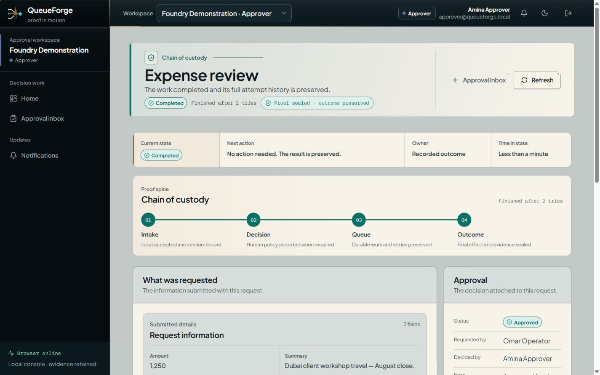
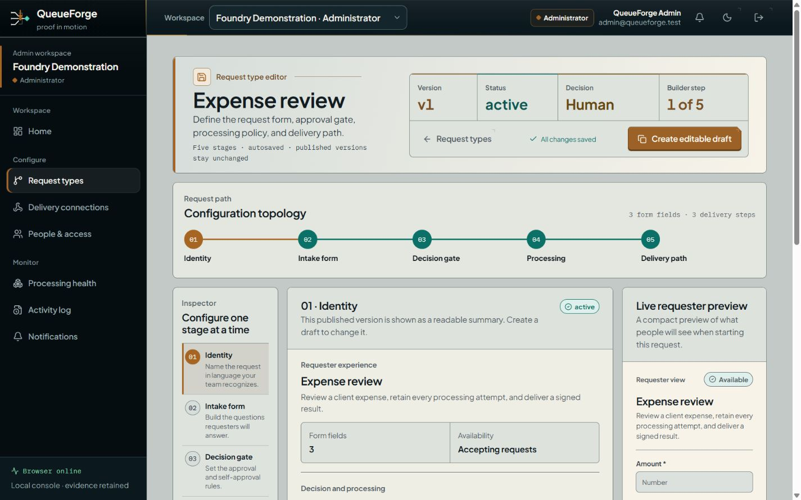
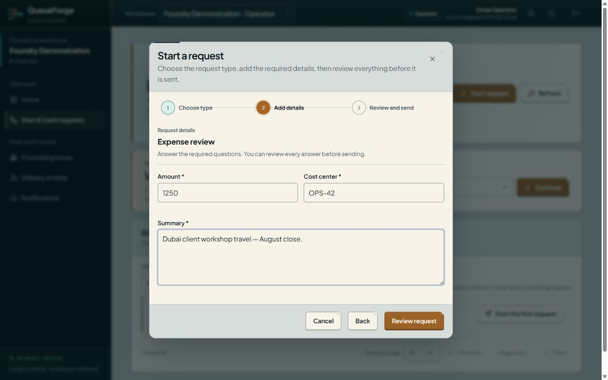
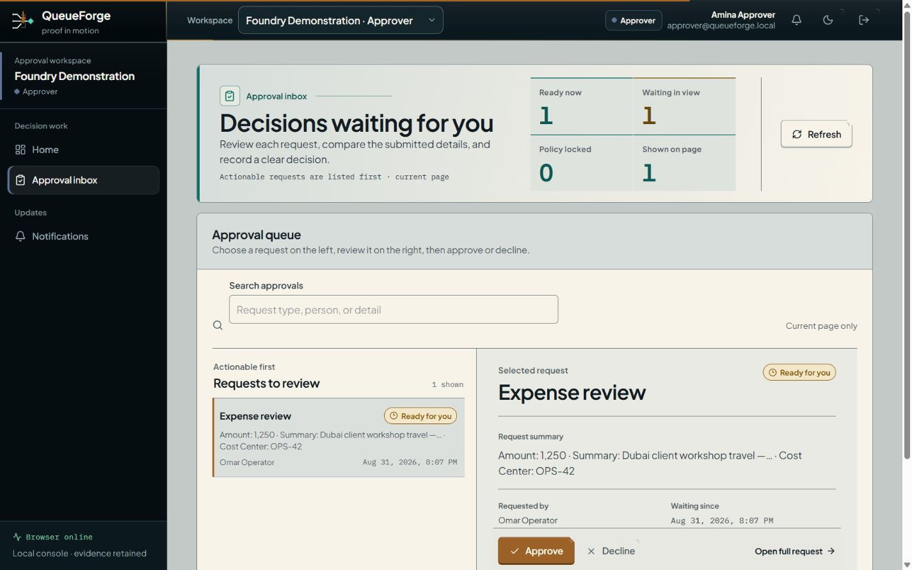
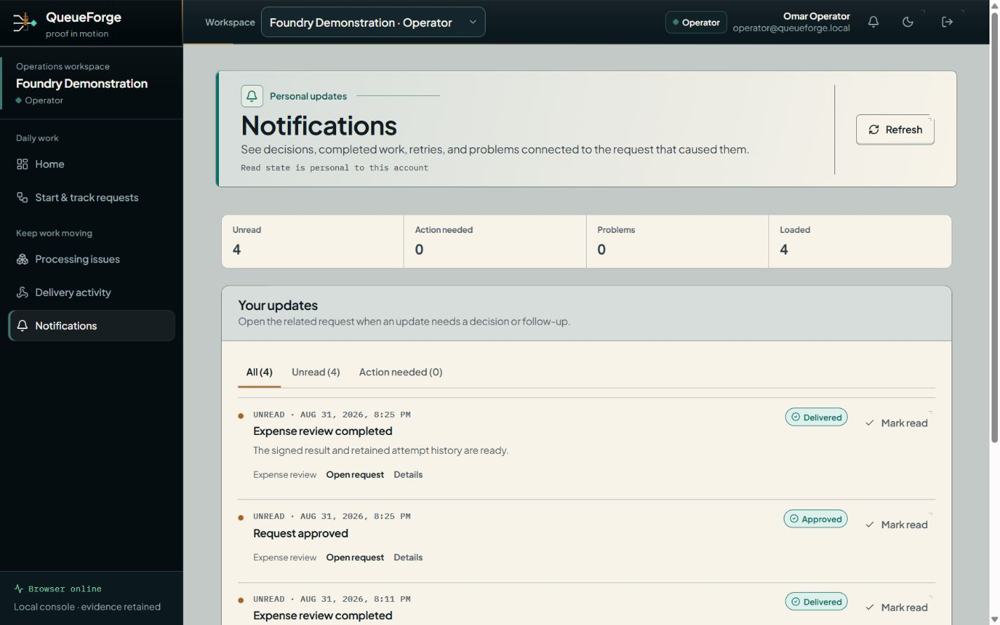
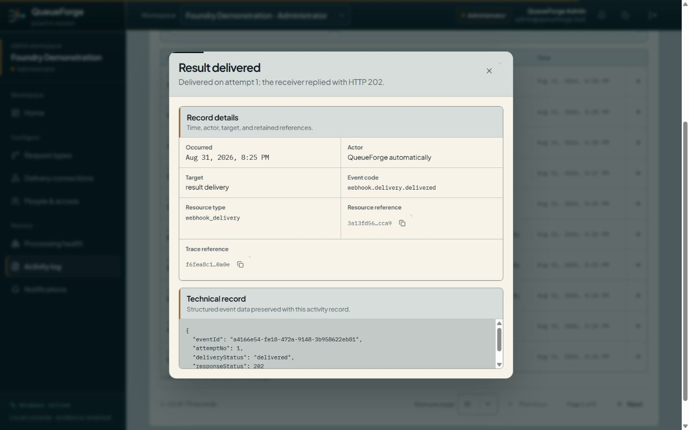
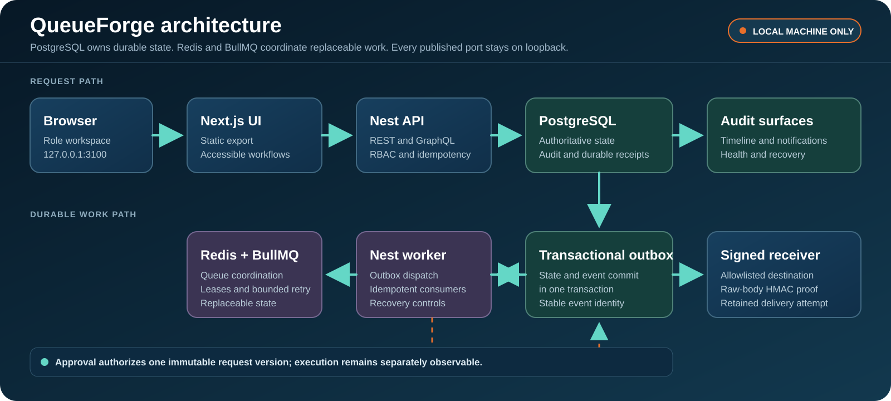

<div align="center">


# QueueForge

**Local-first workflow automation that keeps every request, decision, retry, delivery, and recovery action inspectable.**

QueueForge turns a structured request into one independently approved, durably processed, signed, and auditable outcome without losing the story between systems.

[](https://youtu.be/HSDGOt7D5ZM)
[](https://github.com/Hasan-Al-Hussein/queueforge/archive/refs/heads/main.zip)
[](https://github.com/Hasan-Al-Hussein/queueforge/actions/workflows/ci.yml)
[](https://github.com/Hasan-Al-Hussein/queueforge/actions/workflows/codeql.yml)


[](LICENSE)

[Why it exists](#why-queueforge-exists) · [Demo](#watch-the-complete-workflow) · [Product tour](docs/product-tour.md) · [Pipeline](#end-to-end-pipeline) · [Architecture](#architecture) · [Verification](#verification) · [Security](#security-and-privacy-boundaries)

</div>

Business workflows often split one decision across forms, approvals, queues, workers, webhooks, and audit screens. That fragmentation can approve the wrong version, lose work between a database commit and queue publication, duplicate effects during retries, or make a failure impossible to explain.

QueueForge treats the workflow as one reliability problem. It binds approval to an immutable request version, commits durable work with business state, tolerates repeated queue delivery, signs outbound results, and retains a linked activity trail that people can inspect.

> [!IMPORTANT]
> QueueForge is a single-machine engineering demonstration for synthetic data. It is not an internet-facing deployment reference. Next.js `16.3.2` remains behind a tracked upstream security gate, so every published service must stay on loopback until a vendor-fixed version passes the full regression suite.

## Why QueueForge exists

The project is built around six invariants:

1. **A published request type is immutable.** A changed request needs a new version and a new decision.
2. **Approval is independent.** An approver reviews the exact bound revision, and the submitter cannot approve their own request.
3. **Approval and execution are separate guarantees.** A valid decision authorizes work, but a worker, dependency, database lock, receiver, or rate limit can still fail later.
4. **A failed attempt stays visible.** QueueForge retries the same approved version with stable identities and a bounded budget. Exhausted work moves to deliberate recovery.
5. **PostgreSQL is authoritative.** Business state, audit metadata, idempotency results, and outbox work commit together.
6. **The outcome remains explainable.** Request, decision, attempts, delivery, notifications, and recovery share one linked activity trail.

## Evidence at a glance

| Signal                       | Bounded evidence                                                                                                                                                                      |
| ---------------------------- | ------------------------------------------------------------------------------------------------------------------------------------------------------------------------------------- |
| Guided product demo          | [4 minute 36 second narrated walkthrough](https://youtu.be/HSDGOt7D5ZM) using synthetic local data                                                                                    |
| Complete visual journey      | 14 desktop stages in both light and dark themes, plus 8 mobile captures, for **36 approved screenshots**                                                                              |
| Asset integrity              | Every screenshot records its path, viewport, byte count, alt text, and SHA-256 digest in the [machine-readable manifest](docs/media/screenshots/final-e4de0d2-b17918e5/manifest.json) |
| Role and tenant boundaries   | Separate administrator, operator, and approver workspaces, self-approval denial, and a visible cross-tenant block                                                                     |
| Durable work evidence        | Retained attempts, bounded retry, receiver acceptance, requester notification, correlated activity, and authorized recovery                                                           |
| Engineering gate             | Pull requests run formatting, lint, strict types, unit/build, accessibility, Storybook, PostgreSQL/Redis integration, browser, load-smoke, secret, and CodeQL checks                  |
| Revision-bound load baseline | At revision `26fa7c8`, 70/70 iterations, 90 HTTP requests, and 232/232 checks completed with no recorded HTTP or correctness failures                                                 |

These results apply only to the linked revision, synthetic fixtures, local environment, and recorded workload. They are not capacity guarantees or evidence of public-exposure readiness.

## Watch the complete workflow

<div align="center">
  <a href="https://youtu.be/HSDGOt7D5ZM">
    
  </a>
  <br />
  <strong><a href="https://youtu.be/HSDGOt7D5ZM">▶ Watch the complete 4:36 guided product demo</a></strong>
  <br />
  <a href="docs/media/queueforge-product-demo.srt">Read or download the 78-cue captions</a>
</div>

The demo begins with the problem and role model, tours every main workspace, and follows one realistic Expense review through submission, independent approval, a retained failed attempt, successful retry, signed delivery, notification, and correlated audit evidence.

## Product journey

These six equally framed captures show the core workflow. Select any image for its full-resolution evidence.

| **01: Configure a versioned request type**                                                                                                                                                                                                          | **02: Submit a readable request**                                                                                                                                                                                                            |
| --------------------------------------------------------------------------------------------------------------------------------------------------------------------------------------------------------------------------------------------------- | -------------------------------------------------------------------------------------------------------------------------------------------------------------------------------------------------------------------------------------------- |
| [](docs/media/screenshots/final-e4de0d2-b17918e5/light/desktop/04-published-request-type.png)                    | [](docs/media/screenshots/final-e4de0d2-b17918e5/light/desktop/05-submit-expense-review.png) |
| **03: Make an independent decision**                                                                                                                                                                                                                | **04: Preserve the processing outcome**                                                                                                                                                                                                      |
| [](docs/media/screenshots/final-e4de0d2-b17918e5/light/desktop/07-approver-review.png)                    | [](docs/media/screenshots/final-e4de0d2-b17918e5/light/desktop/08-processing-completed.png)     |
| **05: Notify the requester**                                                                                                                                                                                                                        | **06: Explain who changed what**                                                                                                                                                                                                             |
| [](docs/media/screenshots/final-e4de0d2-b17918e5/light/desktop/11-requester-notifications.png) | [](docs/media/screenshots/final-e4de0d2-b17918e5/light/desktop/12-correlated-activity.png)    |

Open the complete evidence without mixing unequal image formats:

- [Light desktop contact sheet](docs/media/readme/queueforge-light-contact-sheet.png)
- [Dark desktop contact sheet](docs/media/readme/queueforge-dark-contact-sheet.png)
- [Mobile contact sheet](docs/media/readme/queueforge-mobile-contact-sheet.png)
- [Full 14-step product tour](docs/product-tour.md)
- [Human-readable screenshot index](docs/media/screenshots/manifest.md)

## End-to-end pipeline

[](docs/product-tour.md)

One request moves through explicit role boundaries, immutable configuration, approval bound to the exact request version, an atomic PostgreSQL outbox, durable BullMQ processing, signed delivery, correlated proof, and operator recovery. The [product tour](docs/product-tour.md) connects every visible stage to the final light, dark, and mobile evidence.

## Architecture

[](docs/architecture.md)

The browser uses the static Next.js interface to call one Nest application layer. PostgreSQL owns durable state. The transactional outbox transfers committed work to the worker path, while Redis and BullMQ coordinate replaceable at-least-once execution. The worker signs delivery to an allowlisted receiver, and the UI exposes the resulting audit, notification, health, and recovery records.

See [architecture](docs/architecture.md), [event flow](docs/event-flow.md), and [database design](docs/database.md).

## What I engineered

- Built tenant-scoped REST and GraphQL surfaces over one application layer, with membership-derived context and deny-by-default roles.
- Implemented short-lived in-memory browser access tokens, rotating refresh-token families, and one-time-reveal revocable API keys stored as hashes.
- Designed optimistic workflow drafting with immutable activated versions, canonical target ordering, and request-to-version binding.
- Made submission and approval idempotent, revision-aware, self-approval-safe, and atomic with audit and transactional-outbox insertion.
- Connected a PostgreSQL outbox to three BullMQ queues with durable receipts, bounded retry, lease recovery, and separate dead-letter history.
- Secured inbound and outbound webhooks with raw-body HMAC verification, replay controls, destination allowlisting, DNS and address pinning, and redirect denial.
- Built responsive, accessible role-specific Next.js workspaces with light and dark themes, guided forms, recovery states, and reduced-motion support.
- Added real PostgreSQL and Redis concurrency probes, Playwright role journeys, k6 thresholds, CodeQL, secret scanning, evidence checks, and a fail-closed vendor gate.
- Authored and integrated the QueueForge Attestation Forge 3D asset with deterministic fallback behavior and lifecycle cleanup.

## System capabilities

| Capability               | What it provides                                                                                             |
| ------------------------ | ------------------------------------------------------------------------------------------------------------ |
| Versioned request types  | Human-readable forms, approval rules, processing steps, delivery targets, and immutable activation           |
| Role-specific workspaces | Separate administration, request, approval, operation, delivery, notification, and audit surfaces            |
| Tenant isolation         | Membership-derived tenant context, scoped stores, composite tenant constraints, and forbidden-route handling |
| Independent approval     | Exact revision binding, self-approval prevention, replay protection, and retained decision history           |
| Durable processing       | Transactional outbox, BullMQ coordination, stable event IDs, bounded retry, leases, and recovery controls    |
| Signed delivery          | Allowlisted destinations, raw-body HMAC signatures, retained attempts, and receiver acceptance evidence      |
| Explainable operations   | Linked status, attempt, delivery, notification, audit, worker-freshness, and recovery records                |
| Responsive product UI    | Desktop, mobile, light, dark, keyboard, focus, reduced-motion, and accessibility-tested states               |

## Reliability by design

| Failure mode                                                            | Guardrail                                                                                               | Evidence surface                                                     |
| ----------------------------------------------------------------------- | ------------------------------------------------------------------------------------------------------- | -------------------------------------------------------------------- |
| A caller changes a tenant identifier                                    | Membership-derived context, tenant-scoped stores, and composite tenant foreign keys                     | Cross-tenant integration probes and visible forbidden-route behavior |
| Two clients submit or approve concurrently                              | Stable idempotency keys, uniqueness, resource locks, exact revision checks, and bounded transient retry | Concurrency suites and replay assertions                             |
| The database commits but queue publication fails                        | Domain state and outbox row commit in one PostgreSQL transaction                                        | Outbox persistence, dispatcher, and crash-recovery tests             |
| BullMQ redelivers work                                                  | Stable event IDs, durable consumer receipts, replay-safe database effects, and lease recovery           | Worker recovery and duplicate-receipt tests                          |
| A webhook is forged, replayed, redirected, or targets a private address | Raw-body HMAC, nonce and timestamp receipts, allowlisting, address pinning, and redirect denial         | Inbound and outbound webhook security suites                         |
| An operator needs to explain a failure                                  | Linked timeline, attempts, delivery history, audit, worker freshness, and authorized retry              | Product tour and role-aware browser journey                          |

## Technology

| Layer        | Main components                                                                             |
| ------------ | ------------------------------------------------------------------------------------------- |
| Web          | Next.js 16.3.2, React 19.2, TypeScript 5.9, Motion, Three.js, static export, Storybook      |
| API          | NestJS 11, REST, GraphQL 16, Zod contracts, rotating session families, RBAC                 |
| State        | PostgreSQL 17, TypeORM migrations, composite tenant constraints, transactional outbox       |
| Work         | Redis 8, BullMQ, three queues, durable receipts, leases, bounded retry, dead-letter history |
| Delivery     | Raw-body HMAC verification, signed allowlisted webhooks, local failure-injection sink       |
| Verification | Jest, Vitest, Testing Library, axe-core, Playwright, k6, secretlint, CodeQL                 |
| Runtime      | Node.js 24, pnpm 11.23, Docker Compose, PowerShell 7, loopback-only published ports         |

## Run locally

The standard target is a 16 GB Windows laptop with Node.js `>=24.13.0 <25`, Corepack, pnpm `11.23.0`, Docker Compose v2, Git, and PowerShell 7. PostgreSQL and Redis can stay in Docker while the Node.js processes run on the host.

```powershell
corepack enable
corepack prepare pnpm@11.23.0 --activate
pnpm install --frozen-lockfile
pnpm env:generate
pnpm dev:services
pnpm db:migrate
pnpm db:seed
pnpm dev
```

`pnpm env:generate` creates an ignored `.env` with random local-only secrets and leaves an existing file unchanged. Never commit or print those values. Stop the Node.js processes with `Ctrl+C`, then run `pnpm dev:services:down`.

| Local surface                   | Address                                     |
| ------------------------------- | ------------------------------------------- |
| Dashboard                       | <http://127.0.0.1:3100>                     |
| REST and OpenAPI development UI | <http://127.0.0.1:3001/api/docs>            |
| GraphQL development UI          | <http://127.0.0.1:3001/graphql>             |
| API readiness                   | <http://127.0.0.1:3001/api/v1/health/ready> |
| Demonstration sink history      | <http://127.0.0.1:3300/history>             |

The [environment guide](docs/environment.md) covers the inspected laptop baseline, port overrides, low-memory guidance, full-Compose route, and non-mutating prerequisite check.

## Reproduce the approval and execution invariant

1. Sign in as the seeded operator and submit the synthetic Expense review request.
2. Confirm the request is waiting for approval and names a separate approver.
3. Sign in as the approver and review the exact submitted values.
4. Approve the bound revision, then observe background processing begin.
5. Inspect the retained failed attempt and the successful retry of the same approved version.
6. Confirm the signed receiver accepted the result and the requester received a completion notification.
7. Open the correlated activity record and follow who changed what, when, and why.
8. Attempt cross-tenant access and confirm QueueForge denies it.

The [demo script](docs/demo-script.md) provides the exact safe role journey and failure-injection notes.

## Verification

Every pull request runs two engineering jobs plus CodeQL:

- **Quality, build, and integration:** formatting, lint, strict types, unit tests, builds, accessibility, Storybook, migrations, PostgreSQL and Redis integration, dependency audit, secret scan, and load-summary security.
- **Browser journey and bounded load smoke:** a real seeded role journey against the loopback topology and a pinned k6 smoke run.
- **CodeQL:** JavaScript and TypeScript analysis with the security-extended query suite.

| Command                   | Coverage                                                                    |
| ------------------------- | --------------------------------------------------------------------------- |
| `pnpm verify`             | Formatting, builds, lint, type checking, and unit tests                     |
| `pnpm verify:local`       | Core verification plus real PostgreSQL and Redis integration and web suites |
| `pnpm test:a11y`          | Accessibility checks                                                        |
| `pnpm test:e2e`           | Role-aware browser journey against a running local topology                 |
| `pnpm test:load:smoke`    | Bounded loopback-only k6 smoke                                              |
| `pnpm audit:local`        | Dependency, secret, security, and summary checks                            |
| `pnpm security:next-gate` | Fail-closed vendor advisory decision                                        |

The public-exposure gate is intentionally separate from ordinary engineering health. It remains nonzero while the tracked Next.js advisory exception is open. See [testing](docs/testing.md), [load testing](docs/load-testing.md), and the [security gate record](scripts/next-security-gate.json).

<details>
<summary><strong>Revision-bound local load baseline</strong></summary>

<br />

At revision `26fa7c8`, the fixed local profile completed 70/70 iterations and 90 HTTP requests with 232/232 checks, zero recorded HTTP failures, and zero recorded correctness errors across 78 invariants. The five scenarios covered submissions, idempotency replays, list reads, concurrent approval races, and signed inbound webhooks.

This is evidence from one local laptop and synthetic dataset, not a capacity guarantee, remote CI result, or permission for external exposure.

</details>

## Security and privacy boundaries

- Authentication uses rotating refresh-token families, short-lived access tokens, hashed API keys, and server-side role checks.
- Tenant context comes from authenticated membership rather than caller-controlled identifiers.
- Submission and approval bind to exact request revisions and reject unsafe replay or self-approval.
- PostgreSQL commits business state, audit metadata, idempotency results, and outbox work atomically.
- Inbound and outbound webhooks use raw-body HMAC verification, replay controls, allowlisted destinations, address pinning, and redirect denial.
- Local credentials, `.env`, database and Redis state, runtime logs, browser state, private archives, and generated test evidence are excluded from source control.
- All committed screenshots and fixtures use synthetic local demonstration data.
- Every service stays on `127.0.0.1`. The current HTTP topology has no TLS and must not be exposed to another machine.

See [SECURITY.md](SECURITY.md), [security controls](docs/security.md), and the [threat model](docs/threat-model.md).

## Engineering tradeoffs

| Decision                    | Benefit                                                       | Limit                                                                 |
| --------------------------- | ------------------------------------------------------------- | --------------------------------------------------------------------- |
| PostgreSQL as the authority | Durable state, audit, idempotency, and recovery in one system | More operational weight than an in-memory demo                        |
| Transactional outbox        | Prevents a committed request from losing its queued work      | Adds dispatcher and recovery machinery                                |
| At-least-once processing    | Tolerates worker interruption and broker redelivery           | Consumers and receivers must be idempotent                            |
| Static Next.js export       | Small loopback web surface and simple local serving           | Dynamic server rendering is intentionally unavailable                 |
| Role-specific workspaces    | Clear duties and safer decisions                              | More UI states and authorization tests                                |
| Local-only deployment       | Keeps synthetic demonstration traffic on one machine          | Not a hosted multi-tenant production architecture                     |
| Fail-closed vendor gate     | Prevents accidental public exposure on a known exception      | Public deployment remains blocked until the upstream fix is validated |

## Documentation

| Area      | Guides                                                                                                                                                                     |
| --------- | -------------------------------------------------------------------------------------------------------------------------------------------------------------------------- |
| Product   | [Product tour](docs/product-tour.md) · [Screenshot manifest](docs/media/screenshots/manifest.md) · [Demo script](docs/demo-script.md) · [Career pack](docs/career-pack.md) |
| Design    | [Architecture](docs/architecture.md) · [API design](docs/api-design.md) · [Database](docs/database.md) · [Event flow](docs/event-flow.md)                                  |
| Contracts | [Event contracts](docs/event-contracts.md) · [TypeORM ADR](docs/adr/0001-typeorm.md) · [API split ADR](docs/adr/0002-api-split.md)                                         |
| Assurance | [Security controls](docs/security.md) · [Threat model](docs/threat-model.md) · [Testing](docs/testing.md) · [Load testing](docs/load-testing.md)                           |
| Operation | [Environment baseline](docs/environment.md) · [Troubleshooting](docs/troubleshooting.md) · [Responsible disclosure](SECURITY.md)                                           |

## Repository map

| Path                   | Purpose                                                               |
| ---------------------- | --------------------------------------------------------------------- |
| `apps/api`             | Nest REST, GraphQL, authentication, health, and inbound webhooks      |
| `apps/worker`          | Outbox dispatcher and BullMQ consumers                                |
| `apps/web`             | Responsive static-export Next.js product interface                    |
| `apps/webhook-sink`    | Local signed receiver and failure injector                            |
| `packages/application` | Use cases and authorization policy                                    |
| `packages/domain`      | Pure invariants, hashing, state machine, and retry policy             |
| `packages/persistence` | TypeORM, migrations, stores, seed data, and lock queries              |
| `packages/contracts`   | Zod transport and event contracts                                     |
| `packages/ui`          | Accessible React primitives                                           |
| `tests/integration`    | Real PostgreSQL and Redis integration probes                          |
| `load-tests`           | Bounded loopback-only k6 scenarios                                    |
| `tools/queueforge-3d`  | Source and deterministic build tool for the Attestation Forge asset   |
| `docs`                 | Product evidence, architecture, security, operation, and verification |

## Honest claim boundary

QueueForge demonstrates a transactional outbox, at-least-once processing, and durable deduplication of QueueForge-owned database effects when the relevant tests pass. It does not claim exactly-once queue execution, exactly-once delivery to arbitrary HTTP receivers, PostgreSQL row-level security, cryptographically immutable audit logs, public or cloud readiness, or closed dependency gates that have not been evidenced.

## Roadmap

- Validate the vendor-fixed Next.js release before changing the loopback-only boundary.
- Add release signing and a reproducible public package only after the dependency gate closes.
- Extend operator observability with measured queue-age and receiver-health thresholds.
- Evaluate row-level security only if a production deployment model requires it.
- Add backup, restore, TLS, managed identity, and production monitoring before any non-local deployment.

## License

QueueForge is released under the [MIT License](LICENSE). See [NOTICE.md](NOTICE.md) and [third-party licenses](THIRD_PARTY_LICENSES/) for attribution.

<div align="center">

Designed and engineered by **[Hasan Ahmed Al Hussein](https://github.com/Hasan-Al-Hussein)**.

[LinkedIn](https://www.linkedin.com/in/hasan-al-hussein) · [GitHub portfolio](https://github.com/Hasan-Al-Hussein)

</div>
