<div align="center">

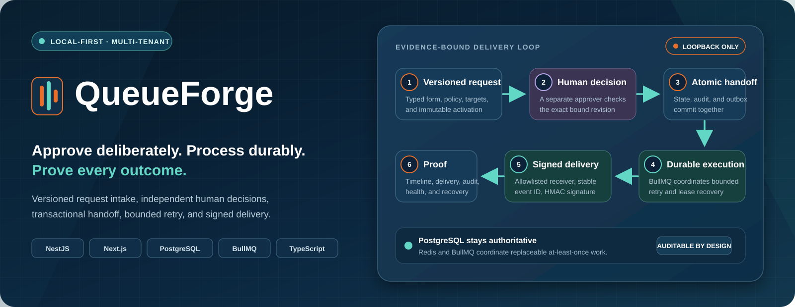

# QueueForge

**Local-first workflow automation where every decision, queue handoff, delivery attempt, and recovery action stays inspectable.**

Define a versioned request, collect structured input, require an independent human decision, process it through a transactional outbox, and deliver a signed result without losing the causal trail.

[](docs/media/queueforge-pipeline-demo.webm)
[](https://github.com/Hasan-Al-Hussein/queueforge/releases/latest)


[](LICENSE)

[Product tour](#see-the-complete-workflow) · [Pipeline](#end-to-end-pipeline) · [Architecture](#architecture) · [Security](SECURITY.md) · [Verification](#verification) · [Windows start](#run-locally)

</div>

> [!IMPORTANT]
> QueueForge is a single-machine engineering demonstration for synthetic data, not an internet-facing deployment reference. Next.js `16.3.2` remains behind an open upstream security gate; the application must stay loopback-only until a vendor-fixed version passes the full regression suite.

## The problem

Business workflows often split one decision across forms, approvals, queues, workers, webhooks, and audit screens. A naive implementation can approve the wrong version, lose work between a database commit and queue publish, duplicate effects during retries, or leave operators unable to explain what happened.

QueueForge treats the workflow as one reliability problem:

- **Administrators** publish immutable request types, approval policy, retry budgets, and delivery targets.
- **Operators** submit ordinary fields without handling internal workflow JSON.
- **Approvers** review the exact bound revision without receiving operator permissions.
- **PostgreSQL** commits domain state, idempotency results, audit metadata, and outbox work atomically.
- **Workers** tolerate at-least-once delivery through stable IDs, durable receipts, bounded retry, and recovery controls.
- **Reviewers** can follow one correlation ID across the request, decision, attempts, delivery, notifications, and audit history.

## Evidence at a glance

| Signal                    | Verified evidence                                                                                                                                                                                 |
| ------------------------- | ------------------------------------------------------------------------------------------------------------------------------------------------------------------------------------------------- |
| Product journey           | **14 labeled real-UI steps** and an **83-second** silent walkthrough using synthetic local data                                                                                                   |
| Runtime UI audit          | **40 role-aware checks**, including **six forbidden-route redirects**, with no observed console, page, request, GraphQL, layout, navigation, or sensitive-data findings                           |
| Remote quality gate       | [Formatting, linting, typing, unit/build, accessibility, Storybook, migrations, integration, and secret scanning passed](https://github.com/Hasan-Al-Hussein/queueforge/actions/runs/32852783495) |
| Browser and load smoke    | [The real role-aware Playwright journey and bounded k6 smoke passed](https://github.com/Hasan-Al-Hussein/queueforge/actions/runs/32852783495)                                                     |
| Static security analysis  | [CodeQL JavaScript/TypeScript analysis passed](https://github.com/Hasan-Al-Hussein/queueforge/actions/runs/32852783495)                                                                           |
| Exposure boundary         | The same workflow intentionally failed the open Next.js advisory gate, preserving the mandatory loopback-only restriction                                                                         |
| Revision-bound local load | **70/70 iterations**, **90 HTTP requests**, **232/232 checks**, and zero recorded correctness or HTTP failures under the documented fixed workload                                                |

Results are bounded to their linked revision, synthetic fixtures, local environment, and recorded workload. They are not capacity guarantees or evidence of public-exposure readiness.

## See the complete workflow

<div align="center">
  <a href="docs/media/queueforge-pipeline-demo.webm">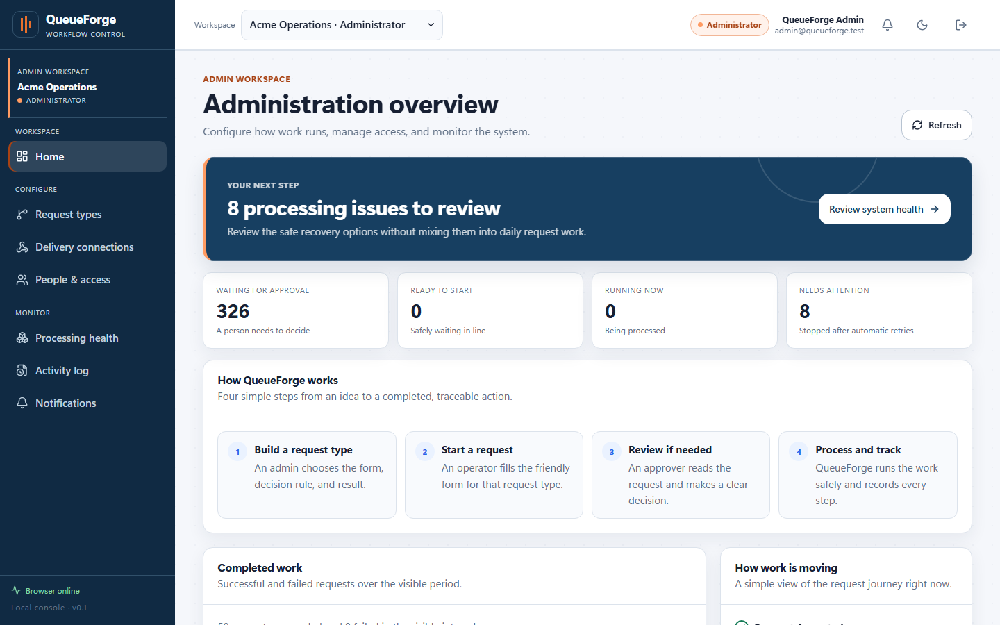</a>
  <br />
  <strong><a href="docs/media/queueforge-pipeline-demo.webm">▶ Watch the 83-second product tour</a></strong>
</div>

The recording follows administration, role boundaries, guided request intake, independent approval, durable processing, signed result delivery, notifications, correlated audit history, tenant isolation, and recovery visibility. Authentication happens before recording, so no generated local password appears.

These ten equally framed captures show the core journey. Select any image for full resolution, or open the [complete 14-step walkthrough](docs/project-handoff/queueforge-pipeline-walkthrough/README.md) for every intermediate state.

| **01 — Role boundaries**                                                                                                                                                                                                                                         | **02 — Signed delivery connection**                                                                                                                                                                                                                                        |
| ---------------------------------------------------------------------------------------------------------------------------------------------------------------------------------------------------------------------------------------------------------------- | -------------------------------------------------------------------------------------------------------------------------------------------------------------------------------------------------------------------------------------------------------------------------- |
| [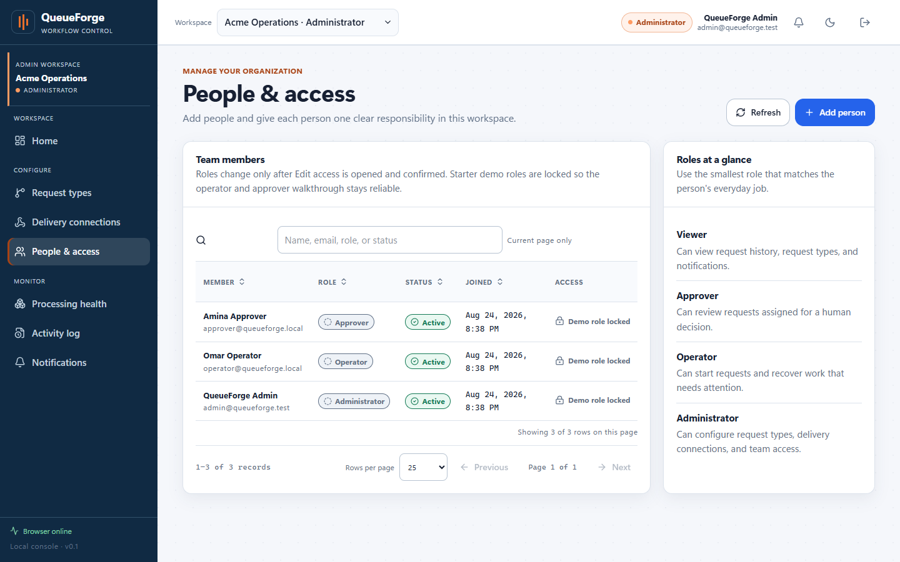](docs/project-handoff/queueforge-pipeline-walkthrough/step_02_people_and_role_boundaries.png) | [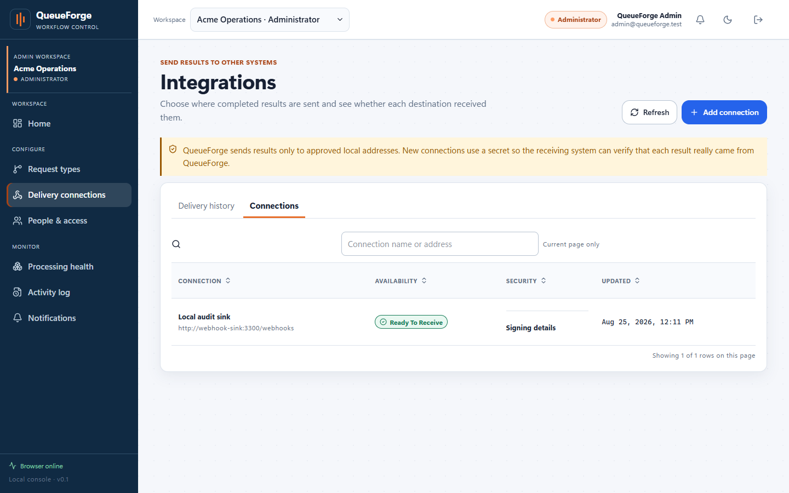](docs/project-handoff/queueforge-pipeline-walkthrough/step_03_delivery_connection_ready.png) |
| **03 — Guided request intake**                                                                                                                                                                                                                                   | **04 — Independent approval**                                                                                                                                                                                                                                              |
| [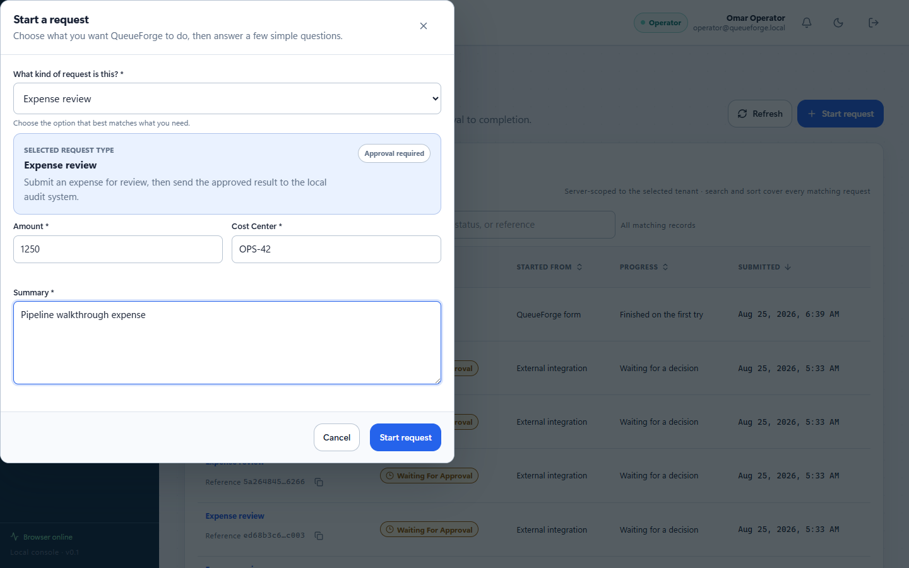](docs/project-handoff/queueforge-pipeline-walkthrough/step_05_operator_fills_request_form.png)            | [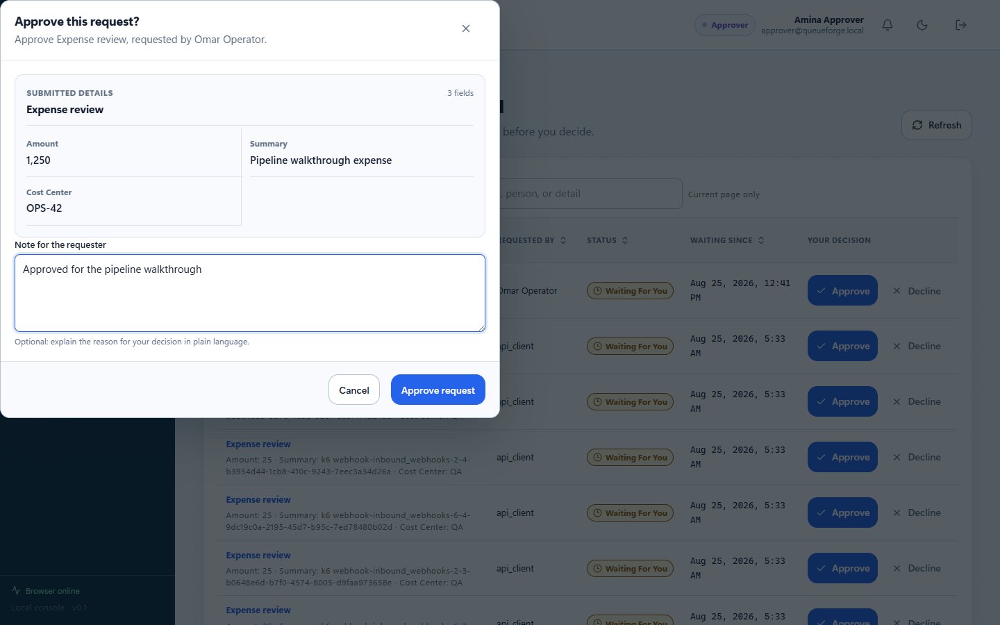](docs/project-handoff/queueforge-pipeline-walkthrough/step_07_approver_reviews_request.png)                                   |
| **05 — Completed request history**                                                                                                                                                                                                                               | **06 — Result delivery history**                                                                                                                                                                                                                                           |
| [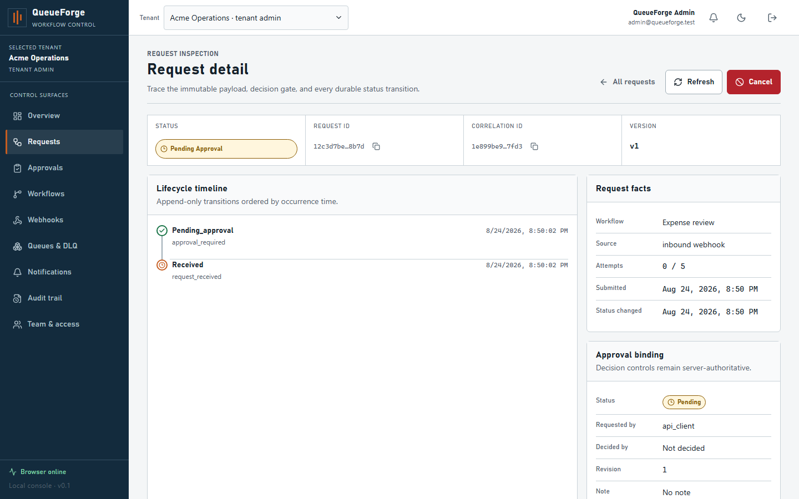](artifacts/screenshots/desktop-request-detail-1440x900.png)                                                              | [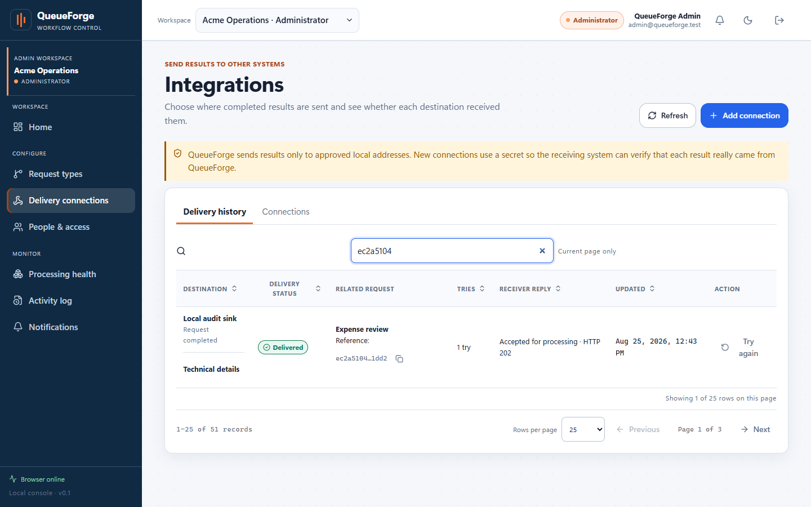](docs/project-handoff/queueforge-pipeline-walkthrough/step_09_result_delivery_history.png)                                         |
| **07 — Requester notifications**                                                                                                                                                                                                                                 | **08 — Correlated activity proof**                                                                                                                                                                                                                                         |
| [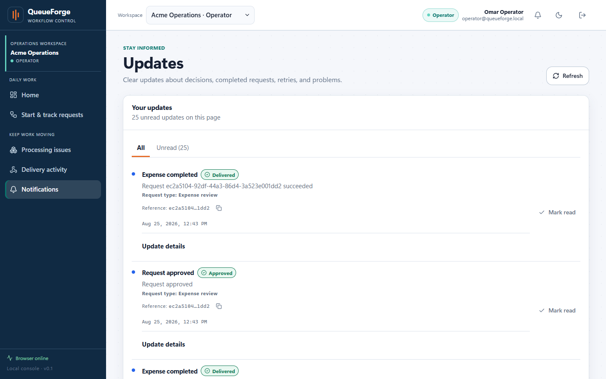](docs/project-handoff/queueforge-pipeline-walkthrough/step_11_requester_notifications.png)                    | [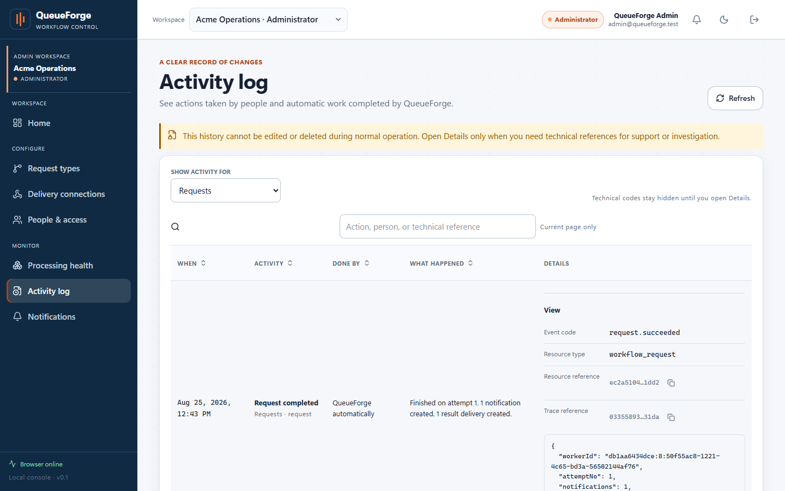](docs/project-handoff/queueforge-pipeline-walkthrough/step_12_correlated_activity_log.png)                            |
| **09 — Cross-tenant denial**                                                                                                                                                                                                                                     | **10 — Processing health and recovery**                                                                                                                                                                                                                                    |
| [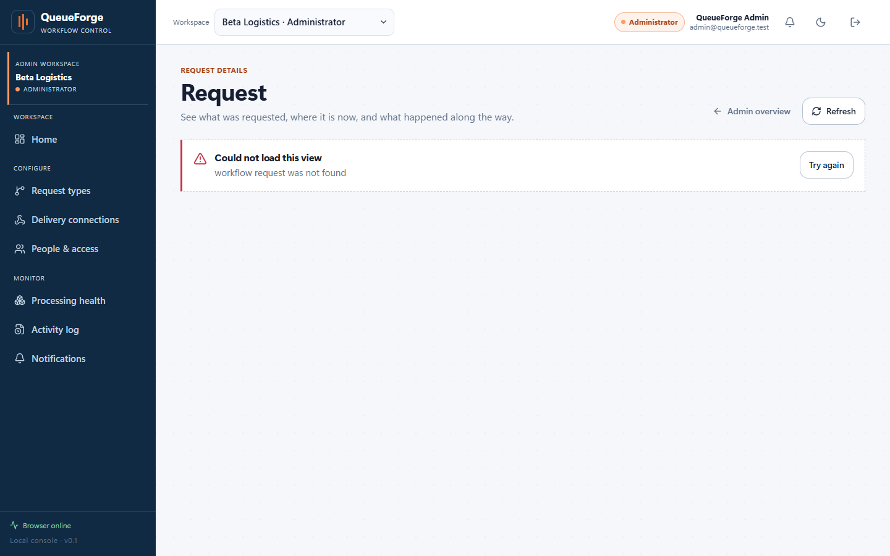](docs/project-handoff/queueforge-pipeline-walkthrough/step_13_cross_tenant_access_blocked.png)           | [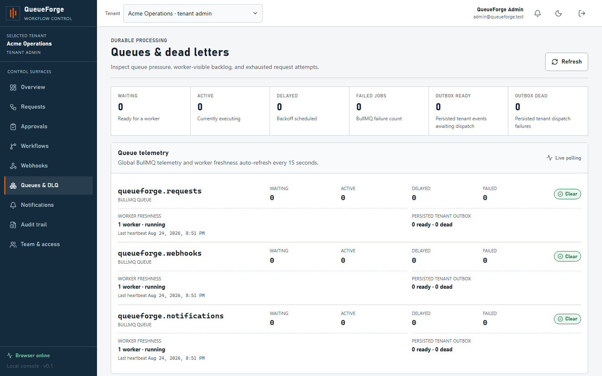](artifacts/screenshots/desktop-operations-1440x900.png)                                                                                            |

**[Watch the complete demo →](docs/media/queueforge-pipeline-demo.webm)** · **[Open all 14 labeled steps →](docs/project-handoff/queueforge-pipeline-walkthrough/README.md)**

## End-to-end pipeline

[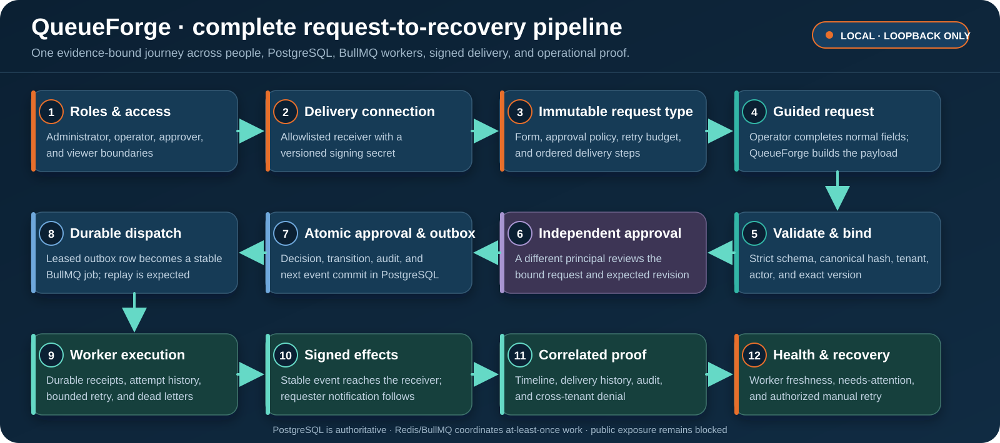](docs/project-handoff/queueforge-pipeline-walkthrough/README.md)

One request moves through explicit role boundaries, immutable configuration, evidence-bound approval, an atomic PostgreSQL outbox, durable BullMQ processing, signed delivery, correlated proof, and operator recovery. The linked walkthrough connects every visible stage to its implementation and verification surface.

## What I engineered

- Built tenant-scoped REST and GraphQL surfaces over one application layer, with membership-derived context and deny-by-default roles.
- Implemented short-lived in-memory browser access tokens, rotating refresh-token families, and one-time-reveal revocable API keys stored as hashes.
- Designed optimistic workflow drafting with immutable activated versions, canonical target ordering, and request-to-version binding.
- Made submission and approval idempotent, revision-aware, self-approval-safe, and atomic with audit and transactional-outbox insertion.
- Connected a PostgreSQL outbox to three BullMQ queues with durable receipts, bounded retry, lease recovery, and separate dead-letter history.
- Secured inbound and outbound webhooks with raw-body HMAC verification, nonce/replay controls, destination allowlisting, DNS/address pinning, and redirect denial.
- Built accessible role-specific Next.js workspaces for intake, approval, processing health, recovery, delivery history, notifications, and correlated audit review.
- Added real PostgreSQL/Redis concurrency probes, Playwright role journeys, k6 thresholds, CodeQL, secret scanning, evidence freshness checks, and a fail-closed vendor gate.

## Architecture

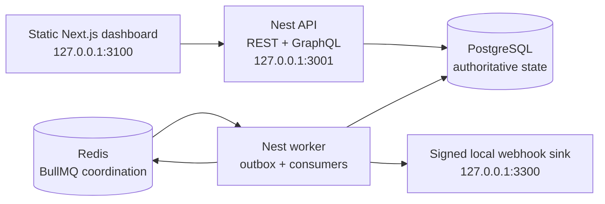

A durably idempotent command transaction commits domain state, bounded audit metadata, its idempotency result, and an outbox row together where the command emits an event. Redis coordinates at-least-once processing; PostgreSQL remains the durable source of truth. See [architecture](docs/architecture.md) and [event flow](docs/event-flow.md).

## Reliability by design

| Failure mode                                                            | Guardrail                                                                                               | Evidence surface                                                     |
| ----------------------------------------------------------------------- | ------------------------------------------------------------------------------------------------------- | -------------------------------------------------------------------- |
| A caller changes a tenant identifier                                    | Membership-derived context, tenant-scoped stores, and composite tenant foreign keys                     | Cross-tenant integration probes and visible forbidden-route behavior |
| Two clients submit or approve concurrently                              | Stable idempotency keys, uniqueness, resource locks, exact revision checks, and bounded transient retry | Concurrency integration suites and replay assertions                 |
| The database commits but queue publication fails                        | Domain state and outbox row commit in one PostgreSQL transaction                                        | Outbox persistence, dispatcher, and crash-recovery tests             |
| BullMQ redelivers work                                                  | Stable event IDs, durable consumer receipts, replay-safe QueueForge effects, and lease recovery         | Worker recovery and duplicate-receipt tests                          |
| A webhook is forged, replayed, redirected, or targets a private address | Raw-body HMAC, nonce/timestamp receipts, allowlisting, DNS/address pinning, and no redirects            | Inbound/outbound webhook security suites                             |
| An operator needs to explain a failure                                  | Correlation-bound timeline, attempts, delivery history, audit, worker freshness, and authorized retry   | Role-aware Playwright journey and processing-health UI audit         |

## Technology

| Layer        | Main components                                                                           |
| ------------ | ----------------------------------------------------------------------------------------- |
| Web          | Next.js 16.3.2, React 19.2, TypeScript 5.9, static export, accessible role workspaces     |
| API          | NestJS 11, REST, GraphQL 16, Zod contracts, rotating session families, RBAC               |
| State        | PostgreSQL, TypeORM migrations, composite tenant constraints, transactional outbox        |
| Work         | Redis, BullMQ, three queues, durable receipts, leases, bounded retry, dead-letter history |
| Delivery     | Raw-body HMAC verification, signed allowlisted webhooks, local failure-injection sink     |
| Verification | Jest, Vitest, Testing Library, axe-core, Playwright, k6 2.2, secretlint, CodeQL           |
| Runtime      | Node.js 24.13, pnpm 11.23, Docker Compose, PowerShell 7, loopback-only published ports    |

## Run locally

The standard target is a 16 GB Windows laptop with Node.js `>=24.13.0 <25`, Corepack, pnpm `11.23.0`, Docker Compose v2, Git, and PowerShell 7. PostgreSQL and Redis can stay in Docker while the Node.js processes run on the host.

### Private Windows package

**[Download the latest QueueForge Windows ZIP and checksum →](https://github.com/Hasan-Al-Hussein/queueforge/releases/latest)**

1. Open Docker Desktop and wait for the engine.
2. Extract the private distribution and double-click `START-QUEUEFORGE.cmd`.
3. Keep the first-start window open while the capped build prepares the stack.
4. When <http://127.0.0.1:3100> opens, use `admin@queueforge.test`; the generated local password is copied without being printed.
5. Double-click `STOP-QUEUEFORGE.cmd` to stop the stack while preserving its private database.

The package creates fresh secrets for each machine and does not require a paid cloud service. The revision-bound packager, `pnpm package:private`, refuses dirty source and excludes `.env`, Git metadata, dependencies, runtime state, and test output.

### Source development

```powershell
corepack enable
corepack prepare pnpm@11.23.0 --activate
pnpm install --frozen-lockfile
pnpm env:generate
pnpm dev:services
pnpm db:migrate
pnpm db:seed
pnpm dev
```

`pnpm env:generate` creates an ignored `.env` with random local-only secrets and leaves an existing file unchanged. Never commit or print those values. Stop the Node.js processes with `Ctrl+C`, then run `pnpm dev:services:down`.

| Local surface               | Address                                     |
| --------------------------- | ------------------------------------------- |
| Dashboard                   | <http://127.0.0.1:3100>                     |
| REST/OpenAPI development UI | <http://127.0.0.1:3001/api/docs>            |
| GraphQL development UI      | <http://127.0.0.1:3001/graphql>             |
| API readiness               | <http://127.0.0.1:3001/api/v1/health/ready> |
| Demonstration sink history  | <http://127.0.0.1:3300/history>             |

<details>
<summary><strong>Open the full local Compose route</strong></summary>

<br />

```powershell
pnpm install --frozen-lockfile
pnpm env:generate
docker compose --profile full up --build
```

The profile runs PostgreSQL, Redis, migration, seed, API, worker, sink, and the static web export with explicit resource caps and loopback-only published ports. Stop it without deleting data using `docker compose --profile full down`.

</details>

<details>
<summary><strong>Open the seeded roles and reviewer journey</strong></summary>

<br />

| Identity                    | Access                                     | Demonstration                                           |
| --------------------------- | ------------------------------------------ | ------------------------------------------------------- |
| `admin@queueforge.test`     | Platform admin; Acme and Beta tenant admin | Configure request types, connections, health, and audit |
| `operator@queueforge.local` | Acme operator                              | Submit, follow, cancel, and retry requests              |
| `approver@queueforge.local` | Acme approver                              | Decide a bound request without operator controls        |
| `outsider@queueforge.local` | Beta operator only                         | Demonstrate tenant isolation                            |

All identities use the locally generated `BOOTSTRAP_ADMIN_PASSWORD`; never replace it with a shared portfolio password. The clearest review uses separate admin, operator, and approver sessions. Follow the [demo script](docs/demo-script.md) for the exact safe journey and failure-injection notes.

</details>

See the [environment guide](docs/environment.md) for the inspected laptop baseline, port overrides, low-memory guidance, and the non-mutating environment check.

## Verification

The linked [GitHub Actions run](https://github.com/Hasan-Al-Hussein/queueforge/actions/runs/32852783495) passed quality/build/integration, the real browser journey with bounded k6 smoke, and CodeQL. Its overall conclusion is intentionally non-green because the separate exposure gate correctly rejected the tracked Next.js advisory exception.

| Command                   | Coverage                                                                |
| ------------------------- | ----------------------------------------------------------------------- |
| `pnpm verify`             | Formatting, linting, type checking, unit tests, and builds              |
| `pnpm verify:local`       | Core verification plus real PostgreSQL/Redis integration and web suites |
| `pnpm test:a11y`          | Accessibility checks                                                    |
| `pnpm test:e2e`           | Role-aware browser journey against a running local topology             |
| `pnpm test:load:smoke`    | Bounded loopback-only k6 smoke                                          |
| `pnpm audit:local`        | Dependency, secret, security, and summary checks                        |
| `pnpm security:next-gate` | Fail-closed vendor advisory decision                                    |

Start isolated test services before the local integration path:

```powershell
pnpm test:services
pnpm verify:local
pnpm test:a11y
```

Reset only the labeled synthetic test database when a clean integration fixture is needed:

```powershell
pnpm test:services:reset
```

The broader release command also invokes end-to-end, load-smoke, dependency, secret, security, and the final Next.js gate:

```powershell
pnpm verify:release
```

`verify:release` does not start the web/API/worker/sink topology required by E2E and load smoke. Keep a migrated, seeded host-first or full-Compose instance running separately before invoking it. The Next.js check runs last and is expected to make the command nonzero while the exception remains open. See [testing](docs/testing.md) for the evidence rules and exact suite boundaries.

## Local performance evidence

The bounded local profile uses the full Docker Compose stack and five scenarios at 2 VUs each: 12 submissions, 6 idempotency replays, 36 list reads, 4 concurrent approval races, and 12 signed inbound webhooks.

```powershell
$env:K6_LOAD_VUS='2'; $env:K6_LOAD_ITERATIONS='12'; pwsh scripts/run-k6.ps1 -Scenario load
```

An accepted run must complete 70/70 iterations and 90 HTTP requests with 232/232 checks, zero HTTP failures, zero correctness errors across 78 invariants, and every configured threshold green.

| Operation            | Required p95 |
| -------------------- | -----------: |
| Concurrent approvals |   < 2,000 ms |
| Idempotency replay   |   < 1,500 ms |
| Request listing      |   < 1,000 ms |
| Request submission   |   < 1,500 ms |
| Signed webhook       |   < 2,000 ms |

The committed smoke/load context and summary pair is the authority for the exact revision, capture time, hardware, starting synthetic dataset, effective command, observed p95 values, checks, and threshold outcomes. The resource gate samples the full Compose profile during the bounded load workload and enforces less than 5 GiB peak memory and less than 4 GiB added disk use. Exact revision-bound results, project/image/volume/cache deltas, and caveats are preserved in [benchmark evidence](test-results/k6/) and [resource evidence](artifacts/verification/resources.json); the claims checker rejects stale evidence or any failed threshold or budget.

These are fixed-workload results from one local laptop and synthetic dataset, not capacity guarantees, remote CI evidence, or permission for external exposure.

## Documentation

| Area      | Guides                                                                                                                                                          |
| --------- | --------------------------------------------------------------------------------------------------------------------------------------------------------------- |
| Product   | [Demo script](docs/demo-script.md) · [14-step walkthrough](docs/project-handoff/queueforge-pipeline-walkthrough/README.md) · [Career pack](docs/career-pack.md) |
| Design    | [Architecture](docs/architecture.md) · [API design](docs/api-design.md) · [Database](docs/database.md) · [Event flow](docs/event-flow.md)                       |
| Contracts | [Event contracts](docs/event-contracts.md) · [TypeORM ADR](docs/adr/0001-typeorm.md) · [API split ADR](docs/adr/0002-api-split.md)                              |
| Assurance | [Security controls](docs/security.md) · [Threat model](docs/threat-model.md) · [Testing](docs/testing.md) · [Load testing](docs/load-testing.md)                |
| Operation | [Environment baseline](docs/environment.md) · [Troubleshooting](docs/troubleshooting.md) · [Responsible disclosure](SECURITY.md)                                |

## Repository layout

```text
apps/
  api/              Nest REST, GraphQL, auth, health, and inbound webhooks
  worker/           Outbox dispatcher and BullMQ consumers
  web/              Static-export Next.js operator dashboard
  webhook-sink/     Local signed receiver and failure injector
packages/
  application/      Use cases and authorization policy
  config/           Environment schemas
  contracts/        Zod transport/event contracts and constants
  domain/           Pure invariants, hashing, state machine, retry policy
  observability/    Structured logging and Prometheus metrics
  persistence/      TypeORM, migrations, stores, seed, and lock queries
  testkit/          Synthetic test helpers
  ui/               Accessible React primitives
docs/               Design, operation, testing, and interview evidence
tests/integration/  Real PostgreSQL/Redis integration probes
load-tests/         Bounded loopback-only k6 scenarios
scripts/            Environment, security-gate, test-service, and k6 helpers
.github/            Commit-pinned CI, CodeQL, and dependency automation
```

## Claim boundary

QueueForge demonstrates a transactional outbox, at-least-once processing, and durable deduplication of QueueForge-owned database effects when the relevant tests pass. It does not claim exactly-once queue execution, exactly-once delivery to arbitrary HTTP receivers, PostgreSQL row-level security, cryptographically immutable audit logs, public/cloud readiness, or closed dependency gates that have not been evidenced.

The current Next.js security exception is recorded in `scripts/next-security-gate.json`. `pnpm security:next-gate` is expected to fail while that record remains open; loopback-only use is mandatory.

## License

QueueForge is released under the [MIT License](LICENSE). See [NOTICE.md](NOTICE.md) for the project boundary and third-party attribution statement.
