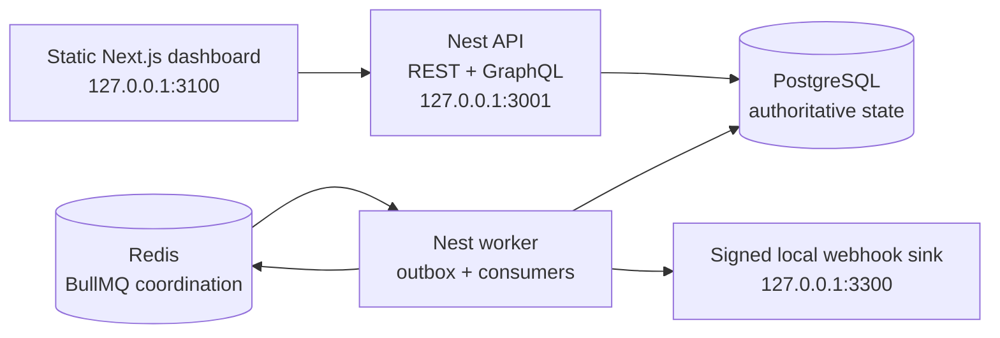
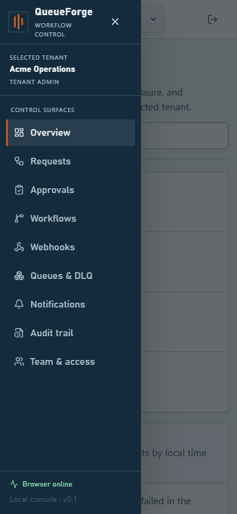

# QueueForge

QueueForge is a local-first, multi-tenant workflow automation system that makes request intake, approvals, durable queue processing, retries, signed webhooks, and audit history visible in one operator dashboard.

It is a portfolio and engineering-demonstration system for synthetic data on a developer laptop. It is **not** an internet-facing deployment reference. Next.js 16.3.2 is currently held behind an open upstream security gate, so the web application must remain loopback-only until that gate is closed with vendor evidence and a full regression run.

## What it demonstrates

- Tenant-scoped REST and GraphQL surfaces backed by one application layer.
- Short-lived in-memory browser access tokens and rotating refresh-token families.
- One-time-reveal, revocable API keys with viewer/operator scope and hashed-at-rest secrets.
- Deny-by-default roles for viewers, approvers, operators, tenant administrators, and platform administrators.
- Versioned workflows with optimistic draft autosave and immutable activated versions.
- Idempotent request submission, optional self-approval protection, and a centralized state machine.
- A PostgreSQL transactional outbox feeding three BullMQ queues.
- Durable consumer receipts, bounded retry, lease recovery, and separate dead-letter history.
- Raw-body inbound HMAC verification and allowlisted, signed outbound webhooks.
- Correlated request timelines, audit events, queue health, notifications, and worker heartbeats.
- A responsive, accessible static-export Next.js operator interface.

## Architecture at a glance



A durably idempotent command transaction commits domain state, bounded audit metadata, its idempotency result, and an outbox row together where the command emits an event. Redis coordinates at-least-once processing; PostgreSQL remains the durable source of truth. See [architecture](docs/architecture.md) and [event flow](docs/event-flow.md).

## Prerequisites

- Windows with PowerShell 7 for the provided scripts.
- Node.js `>=24.13.0 <25`.
- Corepack with the workspace-pinned pnpm `11.23.0`.
- Docker Engine and Docker Compose v2.
- Git.

The inspected laptop baseline and low-memory operating guidance are in [docs/environment.md](docs/environment.md). Check the host without changing running services:

```powershell
pwsh -NoProfile -File scripts/verify-environment.ps1
```

The command writes `artifacts/verification/environment.json` and reports port conflicts; it does not stop unrelated processes.

## Easiest private start (no paid cloud)

QueueForge can be delivered as a private ZIP and run entirely on the buyer's Windows computer. Nothing is uploaded to Vercel or another paid service.

The buyer needs only the free [Docker Desktop](https://www.docker.com/products/docker-desktop/) application and PowerShell 7. After unzipping QueueForge:

1. Open Docker Desktop and wait until it says the engine is running.
2. Double-click `START-QUEUEFORGE.cmd`.
3. Keep the first-start window open while QueueForge prepares itself. The build is deliberately limited to two CPU cores and 2.5 GB of memory so the laptop stays responsive.
4. The browser opens at <http://127.0.0.1:3100>. Use `admin@queueforge.test`; the generated password is already copied, so press `Ctrl+V` in the password box.
5. Double-click `STOP-QUEUEFORGE.cmd` when finished. The private database is preserved for the next start.

Later starts reuse the prepared images and are much faster. The start script never prints the generated password and never deletes QueueForge's database volumes.

For the seller, create a clean revision-bound ZIP with:

```powershell
pnpm package:private
```

The packager refuses dirty source and checks that `.env`, local databases, dependencies, test output, and Git metadata are absent. Each buyer generates fresh local secrets on first start. A code-signed Windows installer could be added later, but the ZIP plus two launch files is the complete free distribution path today.

## Quick start: host-first development

This is the preferred route on a 16 GB laptop because only PostgreSQL and Redis run in Docker.

```powershell
corepack enable
corepack prepare pnpm@11.23.0 --activate
pnpm install --frozen-lockfile
pnpm env:generate
pnpm dev:services
pnpm db:migrate
pnpm db:seed
pnpm dev
```

`pnpm env:generate` creates `.env` with random local-only secrets and leaves an existing file unchanged. The root development and database commands load that file for their child processes. Do not commit `.env` or paste its values into logs, issues, or screenshots.

Open:

- Dashboard: <http://127.0.0.1:3100>
- REST/OpenAPI UI in development: <http://127.0.0.1:3001/api/docs>
- GraphQL development UI: <http://127.0.0.1:3001/graphql>
- API readiness: <http://127.0.0.1:3001/api/v1/health/ready>
- Webhook-sink history: <http://127.0.0.1:3300/history>

Stop the foreground Node processes with `Ctrl+C`, then stop only QueueForge's development dependencies:

```powershell
pnpm dev:services:down
```

## Full local Compose demonstration

The full profile builds and runs PostgreSQL, Redis, migration, seed, API, worker, webhook sink, and the statically exported web app with explicit resource caps:

```powershell
pnpm install --frozen-lockfile
pnpm env:generate
docker compose --profile full up --build
```

Use `Ctrl+C` for a foreground run. To stop the named QueueForge services without deleting their data volumes:

```powershell
docker compose --profile full down
```

The full build is more memory-intensive than host-first development. It binds published ports to `127.0.0.1` only.

## Seeded demo identities

All seeded users use the randomly generated value of `BOOTSTRAP_ADMIN_PASSWORD` in your local `.env`.

| Email                       | Global/tenant access                          | Suggested demonstration                   |
| --------------------------- | --------------------------------------------- | ----------------------------------------- |
| `admin@queueforge.test`     | Platform admin; tenant admin in Acme and Beta | Tenant switch, workflow/admin, audit      |
| `approver@queueforge.local` | Acme approver                                 | Approve or reject without operator rights |
| `operator@queueforge.local` | Acme operator                                 | Submit, cancel, retry, and replay         |
| `outsider@queueforge.local` | Beta operator only                            | Demonstrate tenant isolation              |

The seed also activates:

- Acme `expense_review`: requires `amount`, `costCenter`, and `summary`; requires approval; prevents self-approval; then runs processor, webhook, and notification targets.
- Beta `access_review`: requires `system` and `reason`; bypasses approval; runs a processor target.

Never replace the generated password with a shared portfolio password. Read it locally from `.env` immediately before the demo.

## Ports and environment

| Component       | Default | Configuration                                                    |
| --------------- | ------: | ---------------------------------------------------------------- |
| Web             |  `3100` | fixed host dev port; `WEB_PORT` for the Compose loopback binding |
| API / GraphQL   |  `3001` | `API_PORT`, `NEXT_PUBLIC_API_URL`, `NEXT_PUBLIC_GRAPHQL_URL`     |
| Webhook sink    |  `3300` | `SINK_PORT`, `DEMO_WEBHOOK_TARGET_URL`                           |
| PostgreSQL      |  `5432` | `POSTGRES_PORT`, `DATABASE_URL`, `MIGRATION_DATABASE_URL`        |
| Redis           |  `6379` | `REDIS_PORT`, `REDIS_URL`                                        |
| Test PostgreSQL | `55432` | `TEST_POSTGRES_PORT`, `TEST_DATABASE_URL`                        |
| Test Redis      | `56379` | `TEST_REDIS_PORT`, `TEST_REDIS_URL`                              |

`.env.example` is the field reference; `pnpm env:generate` is the safe local initializer. Runtime parsing fails closed when required secrets or URLs are missing or malformed.

## Verification

Start isolated test services before PostgreSQL/Redis integration suites:

```powershell
pnpm test:services
pnpm verify:local
pnpm test:a11y
```

Reset only the labeled synthetic test database when a clean integration fixture is needed:

```powershell
pnpm test:services:reset
```

The broader release command also invokes end-to-end, load-smoke, dependency, secret, security, and the final Next.js gate:

```powershell
pnpm verify:release
```

`verify:release` does not start the web/API/worker/sink topology required by E2E and load smoke. Keep a migrated, seeded host-first or full-Compose instance running separately before invoking it. The Next.js check runs last and is expected to make the command nonzero while the exception remains open. Run `pnpm security:next-gate` directly when only that known gate needs inspection.

Configured commands are not proof of a passing run. This repository does not claim remote CI success or benchmark results without an attached run artifact. See [testing](docs/testing.md) and [load testing](docs/load-testing.md).

## Local performance evidence

The bounded local profile uses the full Docker Compose stack and five scenarios at 2 VUs each: 12 submissions, 6 idempotency replays, 36 list reads, 4 concurrent approval races, and 12 signed inbound webhooks.

```powershell
$env:K6_LOAD_VUS='2'; $env:K6_LOAD_ITERATIONS='12'; pwsh scripts/run-k6.ps1 -Scenario load
```

An accepted run must complete 70/70 iterations and 90 HTTP requests with 232/232 checks, zero HTTP failures, zero correctness errors across 78 invariants, and every configured threshold green.

| Operation            | Required p95 |
| -------------------- | -----------: |
| Concurrent approvals |   < 2,000 ms |
| Idempotency replay   |   < 1,500 ms |
| Request listing      |   < 1,000 ms |
| Request submission   |   < 1,500 ms |
| Signed webhook       |   < 2,000 ms |

The committed smoke/load context and summary pair is the authority for the exact revision, capture time, hardware, starting synthetic dataset, effective command, observed p95 values, checks, and threshold outcomes. The resource gate samples the full Compose profile during the bounded load workload and enforces less than 5 GiB peak memory and less than 4 GiB added disk use. Exact revision-bound results, project/image/volume/cache deltas, and caveats are preserved in [benchmark evidence](test-results/k6/) and [resource evidence](artifacts/verification/resources.json); the claims checker rejects stale evidence or any failed threshold or budget.

These are fixed-workload results from one local laptop and synthetic dataset, not capacity guarantees, remote CI evidence, or permission for external exposure.

## Visual evidence

Captured on **2026-08-24** from the loopback-only **full Docker Compose packaged profile** after API, database, and Redis readiness passed. These screens contain seeded synthetic demonstration data only. The [runtime audit report](artifacts/screenshots/runtime-audit-report.json) records 20 authenticated route checks across 1440×900 desktop and 390×844 mobile viewports; this capture observed zero console or page errors, failed requests, HTTP error responses, GraphQL errors, or sensitive-data findings.

These images are UI and runtime evidence for this bounded local capture only. They are not evidence of remote CI, benchmark performance, or readiness for external exposure. See the [demo script](docs/demo-script.md) for the reproducible walkthrough.

| Desktop control overview                                                                                                                          | Request lifecycle detail                                                                                                               |
| ------------------------------------------------------------------------------------------------------------------------------------------------- | -------------------------------------------------------------------------------------------------------------------------------------- |
|   |  |
| **Queue and worker telemetry**                                                                                                                    | **Mobile navigation**                                                                                                                  |
|  |        |

## Documentation

- [Architecture](docs/architecture.md)
- [API design and route map](docs/api-design.md)
- [Database design](docs/database.md)
- [Event contracts](docs/event-contracts.md)
- [End-to-end event flow](docs/event-flow.md)
- [Security controls](docs/security.md)
- [Threat model](docs/threat-model.md)
- [Testing](docs/testing.md)
- [Load testing](docs/load-testing.md)
- [Troubleshooting](docs/troubleshooting.md)
- [Demo script](docs/demo-script.md)
- [Career pack](docs/career-pack.md)
- [Environment baseline](docs/environment.md)
- [Architecture decisions](docs/adr/0001-typeorm.md) and [API split ADR](docs/adr/0002-api-split.md)

## Repository layout

```text
apps/
  api/              Nest REST, GraphQL, auth, health, and inbound webhooks
  worker/           Outbox dispatcher and BullMQ consumers
  web/              Static-export Next.js operator dashboard
  webhook-sink/     Local signed receiver and failure injector
packages/
  application/      Use cases and authorization policy
  config/           Environment schemas
  contracts/        Zod transport/event contracts and constants
  domain/           Pure invariants, hashing, state machine, retry policy
  observability/    Structured logging and Prometheus metrics
  persistence/      TypeORM, migrations, stores, seed, and lock queries
  testkit/          Synthetic test helpers
  ui/               Accessible React primitives
docs/               Design, operation, testing, and interview evidence
tests/integration/  Real PostgreSQL/Redis integration probes
scripts/            Environment, security-gate, test-service, and k6 helpers
```

## Claim boundary

QueueForge demonstrates a transactional outbox, at-least-once processing, and durable deduplication of QueueForge-owned database effects when the relevant tests pass. It does not claim exactly-once queue execution, exactly-once delivery to arbitrary HTTP receivers, PostgreSQL row-level security, cryptographically immutable audit logs, public/cloud readiness, or closed dependency gates that have not been evidenced.

The current Next.js security exception is recorded in `scripts/next-security-gate.json`. `pnpm security:next-gate` is expected to fail while that record remains open; loopback-only use is mandatory.
