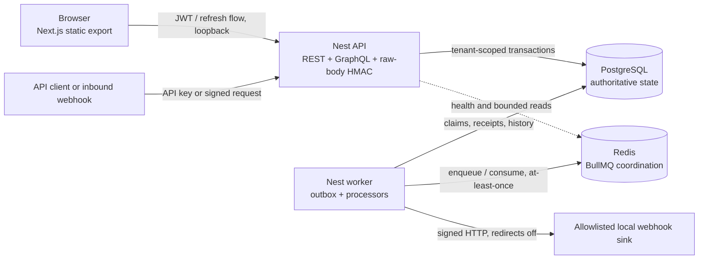
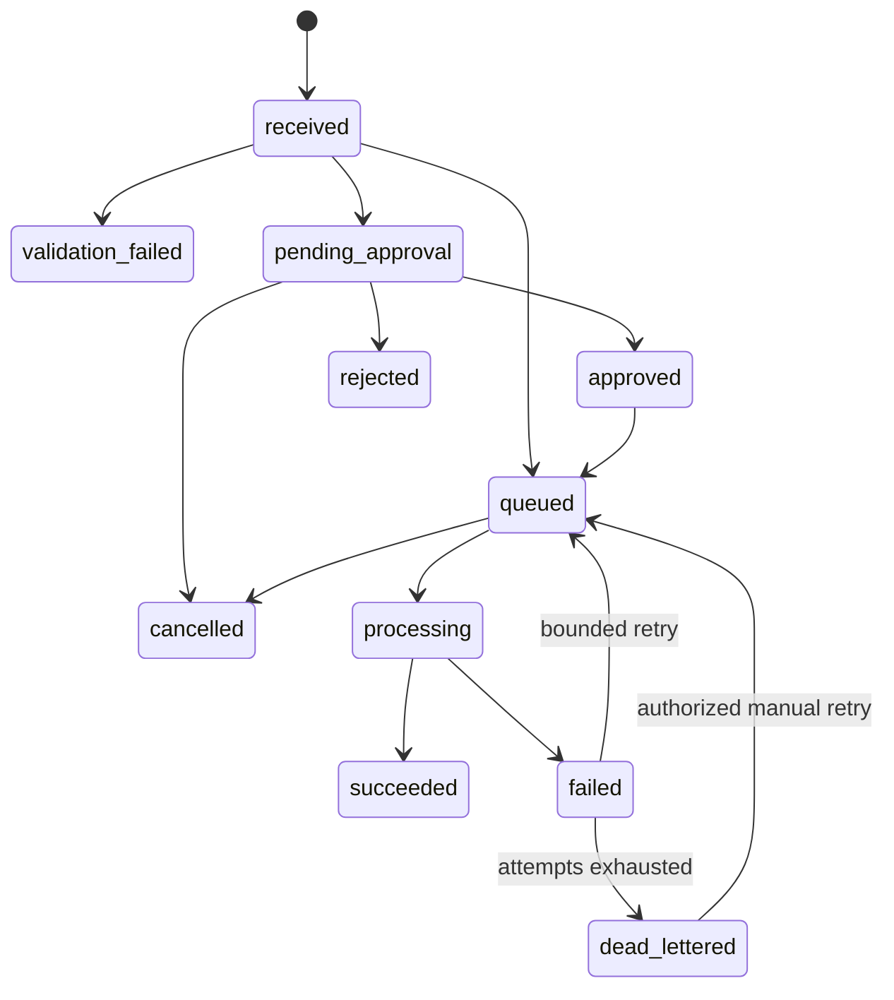

# QueueForge architecture

## Purpose and scope

QueueForge is a local-only, multi-tenant workflow automation demonstration. Its central engineering path is:

> authenticated request submission -> optional approval -> durable PostgreSQL outbox -> BullMQ processing -> signed local webhook -> correlated audit history

The architecture is designed to prove isolation, idempotency, recoverability, and operational visibility on a 16 GB Windows laptop. It is not an internet-facing deployment reference and does not claim cloud hardening, PostgreSQL row-level security, cryptographically immutable audit history, or exactly-once delivery.

This document is the approved design baseline. Test reports and measured evidence, not this design alone, determine which implementation claims are complete.

## Runtime topology

The preferred development mode runs PostgreSQL and Redis in Docker and the four Node.js applications on the host. A full, capped Compose topology is also provided for the local demonstration. The web artifact is a static Next.js App Router export; it has no Server Actions or Next route handlers and calls the Nest API directly.

## Applications and package boundaries

| Component                | Responsibility                                                                                              | Must not own                                         |
| ------------------------ | ----------------------------------------------------------------------------------------------------------- | ---------------------------------------------------- |
| `apps/api`               | REST, GraphQL, authentication, inbound HTTP/webhooks, validation, health and metrics                        | Background processing or direct queue business rules |
| `apps/worker`            | Outbox dispatch, BullMQ processors, retries, progress, heartbeats, notifications, webhook delivery and DLQs | Public HTTP business endpoints                       |
| `apps/web`               | Responsive static operator dashboard, forms, tables, charts and permission-aware UI                         | Server-side secrets or authorization enforcement     |
| `apps/webhook-sink`      | Local signed-receiver demonstration and stable-event deduplication                                          | Proof of arbitrary receiver exactly-once behavior    |
| `packages/contracts`     | Zod-validated transport types, event envelope, constants and shared status vocabulary                       | Database entities or framework-specific logic        |
| `packages/config`        | Central environment parsing and validation                                                                  | Business defaults hidden from domain rules           |
| `packages/domain`        | Pure state machine, canonicalization, hashes, retry policy and invariant logic                              | HTTP, BullMQ or TypeORM types                        |
| `packages/persistence`   | TypeORM entities, migrations, tenant-scoped adapters and PostgreSQL lock queries                            | Unrestricted repositories exposed to transports      |
| `packages/application`   | Use cases, authorization policy and transaction orchestration                                               | Transport-specific response formatting               |
| `packages/observability` | Correlated structured logging and metrics helpers                                                           | Sensitive payload or secret storage                  |
| `packages/ui`            | Reusable accessible React components                                                                        | Authentication authority                             |
| `packages/testkit`       | Synthetic fixtures and test helpers                                                                         | Runtime dependencies                                 |

The dependency direction is `contracts -> config/domain -> persistence -> application`, with observability shared by backend processes, UI isolated to the web app, and testkit restricted to tests. Domain and application code do not import controllers, resolvers, queues, or ORM repositories.

## Authoritative state and tenancy

PostgreSQL is authoritative for tenants, identities, memberships, workflow versions, requests, transitions, approvals, idempotency records, outbox rows, processing receipts, webhook deliveries, notifications, dead letters, worker heartbeats, and audit/security events.

Every tenant-owned table uses a non-null tenant identifier, tenant-leading indexes, and composite tenant relationships. A child row therefore cannot refer to a parent from a different tenant even if application code supplies the wrong identifier. Reads and writes still require a tenant-scoped adapter; database constraints do not replace authorization.

Tenant context is derived only from a validated JWT/session membership, an audited platform-admin tenant selection, or a hashed API key. No tenant-override header or request-body field is supported. Object lookups include tenant scope so authorization failures do not reveal another tenant's object existence.

Queue payloads carry tenant and correlation identifiers, but the worker treats them as routing inputs rather than authorization proof. It re-establishes tenant scope against PostgreSQL before applying effects.

## Workflow and request invariants

Activated workflow content is immutable. Draft autosave uses an expected revision compare-and-swap; activation locks the template, retires the previous active version without modifying its content, hashes the draft, and activates it in one transaction. Editing an active workflow creates a new draft version.

The centralized state machine admits only these transitions:

Approval binds the task, request, workflow version, and canonical payload hash. The deciding transaction locks the task and request; rechecks tenant, role, revision, and self-approval policy; inserts one unique decision; transitions the request; and appends audit and outbox records. An identical replay returns the prior result. Stale, opposite, self-forbidden, or unauthorized decisions fail without starting execution.

## Transactional outbox and processing model

A command transaction commits its domain mutation, transition, bounded audit metadata, idempotency result, and outbox event together. The dispatcher claims due or expired-lease rows with `FOR UPDATE SKIP LOCKED`, commits the lease, then enqueues a BullMQ job with deterministic identifier `qf-<event UUID>`.

The enqueue and outbox publish marker cannot be one distributed transaction. A crash after enqueue but before marking the row published therefore causes a legitimate replay. QueueForge handles that window through:

- deterministic BullMQ job identifiers;
- database `processed_events` receipts keyed by tenant, consumer, and event;
- worker effects, receipt, attempts, transition, audit, and follow-on outbox rows committed together;
- bounded retry with exponential backoff and jitter;
- reclaimable expired leases;
- separate request-processing and outbound-delivery dead-letter histories.

These controls prevent repeated QueueForge database effects when proven by tests. They do not make arbitrary HTTP delivery exactly once. Redis and BullMQ are coordination infrastructure and may replay work; PostgreSQL retains the durable truth needed to recover.

## Authentication and authorization

Tenant roles are:

- `viewer`: read tenant resources;
- `approver`: viewer capabilities plus approval decisions;
- `operator`: viewer capabilities plus submit, cancel, retry, and replay operations;
- `tenant_admin`: tenant configuration, membership, API-client, and workflow administration plus operational permissions;
- `platform_admin`: global role that enters a tenant only through an audited selection action.

API clients are limited to viewer or operator scope. Self-approval policy applies regardless of role.

Passwords use Argon2id. Browser access JWTs are short-lived, session-bound, and held in memory. Opaque refresh tokens are hashed and rotate in locked families; reuse of a consumed or revoked token revokes the family. The refresh cookie is HttpOnly, SameSite=Lax, path-scoped, and `Secure` only when TLS is actually enabled. Refresh and logout require an allowed Origin and double-submit CSRF token. CORS allows only the configured web origin with credentials.

## Transport boundaries

REST under `/api/v1` owns externally meaningful commands and operations: authentication, workflows, request submission and lifecycle actions, approvals, webhook configuration/delivery/replay, notifications, audit, tenant administration, queues, dead letters, and health. Effectful replay-sensitive routes use durable `Idempotency-Key` binding where repetition could duplicate work, including request submission, selected creation/lifecycle commands, and approval decisions. Clone draft converges through transactional state, while repeated activation and dead-letter retry are evaluated against changed state. The exact route matrix and API-client/webhook-endpoint one-time-secret replay behavior are documented in [API design](api-design.md).

GraphQL at `/graphql` supplies bounded dashboard, workflow, request-list, and request-detail compositions. Its `submitWorkflowRequest` and `decideApproval` mutations call the same application services used by REST. It does not duplicate administrative CRUD or webhook operations and has no subscriptions. Body, depth, complexity, aliases, pagination, and introspection are constrained as documented in ADR 0002.

The shared error vocabulary is returned without stacks or secrets and is correlated by request and correlation UUIDs. Correlation context continues through transactions, events, jobs, attempts, deliveries, notifications, and audit history.

## Webhook boundaries

Inbound webhooks verify HMAC-SHA256 over the raw, unparsed request body before JSON parsing. Timestamp skew, nonce uniqueness, key version, signature length, and external idempotency are enforced durably.

Outbound webhook deliveries snapshot the URL, payload, and key version. The worker permits only `http` or `https`, disables redirects, applies a timeout, and resolves and rechecks the exact local allowlist to reduce SSRF and DNS-rebinding risk. Each attempt is signed and recorded separately from request-processing state. Secrets are encrypted at rest with explicit key versions and active/retiring rotation states.

## Observability and failure posture

Every entry point accepts or creates request and correlation UUIDs. Structured HTTP logging explicitly redacts authorization/cookie headers, response cookies, idempotency/signature/CSRF headers, REST credential fields, and their GraphQL variable equivalents; a regression test fixes that path list. Call sites emit bounded operational metadata rather than raw workflow payloads. Metrics use bounded labels; tenant, request, event, and correlation UUIDs belong in logs or traces, not unbounded metric dimensions.

Readiness distinguishes PostgreSQL and Redis dependency state from liveness. Worker heartbeats, queue counts, retry state, dead letters, delivery attempts, and audit timelines provide local operational visibility. A dependency outage must produce a bounded error or retry state, not silent success.

Promotion stops on any cross-tenant disclosure, duplicate domain effect, invalid approval or token replay, lost committed outbox work, accepted forged/replayed webhook, secret leakage, breached resource budget, or unpatched critical dependency for exposure.

## Deployment and claim boundary

QueueForge is intentionally a local portfolio system using synthetic data. The static-export choice and local allowlist reduce the exposed surface, but they do not convert the design into a production deployment. There is no claim of:

- public or cloud readiness;
- multi-region operation;
- RLS-backed tenancy;
- exactly-once queue or webhook delivery;
- cryptographically immutable audit logs;
- remote CI success until a real remote run exists.

Next.js 16.3.2 remains under an open critical upstream security gate. Only loopback implementation/testing is permitted until the applicable vendor patch is exact-pinned and the documented dependency, web, end-to-end, and regression gates pass.
