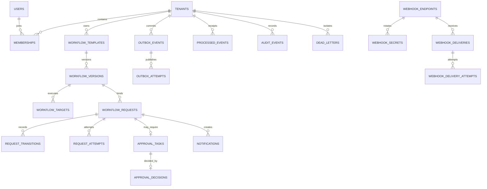

# QueueForge database design

## Design goals

PostgreSQL 17 is QueueForge's authoritative state store. The schema is designed around four correctness goals:

1. tenant relationships cannot cross tenant boundaries;
2. workflow/request identity and history remain stable;
3. durably idempotent commands, their results, audit metadata, and outbox events commit together where applicable;
4. concurrent workers can claim recoverable work without a global queue lock.

TypeORM maps entities and owns migration execution, but the critical constraints, partial indexes, triggers, grants, and locking queries are explicit PostgreSQL SQL. Schema synchronization is disabled. See [ADR 0001](adr/0001-typeorm.md).

QueueForge does **not** use or claim PostgreSQL row-level security. Tenant-scoped application stores plus composite database constraints are the selected controls.

## Roles and migration lifecycle

- `queueforge_owner` owns the schema and runs migrations through `MIGRATION_DATABASE_URL`.
- `queueforge_app` is the runtime role used through `DATABASE_URL`.
- The Docker PostgreSQL initializer creates the runtime role before the first migration.
- The initial migration is `InitialSchema1700000000000`; it has an explicit `down` path.

Apply or revert from the repository root:

```powershell
pnpm db:migrate
pnpm db:migrate:revert
```

Never enable TypeORM `synchronize`. Treat a migration revert as destructive and use it only against a disposable local/test database after verifying the connection target.

## High-level relationship model



Most tenant-owned primary keys begin with `(tenant_id, id)`. Composite foreign keys repeat `tenant_id`, so a child created under tenant A cannot reference a parent under tenant B even if the UUID exists.

## Table groups

| Area                   | Tables                                                                                                                                               | Important invariants                                                                                       |
| ---------------------- | ---------------------------------------------------------------------------------------------------------------------------------------------------- | ---------------------------------------------------------------------------------------------------------- |
| Identity/session       | `tenants`, `users`, `memberships`, `api_clients`, `refresh_token_families`, `refresh_tokens`, `security_events`                                      | Case-insensitive unique email; selected tenant must be a membership; refresh rotation is family-bound      |
| Workflow configuration | `workflow_templates`, `workflow_versions`, `workflow_targets`                                                                                        | One draft and one active version per template; target positions unique; active content immutable           |
| Request lifecycle      | `workflow_requests`, `request_transitions`, `request_attempts`                                                                                       | Request binds exact workflow version and payload hash; identity fields immutable; attempts numbered        |
| Approval               | `approval_tasks`, `approval_decisions`                                                                                                               | One task per request and one decision per task; task/request/version/payload hash bound together           |
| HTTP idempotency       | `idempotency_records`                                                                                                                                | Unique tenant + endpoint scope + key hash; completed response and fingerprint retained                     |
| Durable messaging      | `outbox_events`, `outbox_attempts`, `processed_events`, `dead_letters`                                                                               | Due/lease indexes; deterministic event identity; one durable consumer receipt                              |
| Webhooks               | `webhook_endpoints`, `webhook_secrets`, `inbound_webhook_replay_keys`, `inbound_webhook_receipts`, `webhook_deliveries`, `webhook_delivery_attempts` | Encrypted versioned secrets; nonce/event/key replay protection; immutable delivery snapshot and generation |
| Operations             | `notifications`, `notification_deliveries`, `audit_events`, `worker_nodes`                                                                           | Recipient-scoped notifications; bounded audit metadata; heartbeat freshness                                |

## Workflow immutability

Each template has a stable external key and an enable switch. Draft content includes JSON request schema, approval policy, processing configuration, and ordered processor/webhook/notification targets.

Partial unique indexes permit at most one `draft` and one `active` version for `(tenant_id, template_id)`. Activation calculates a SHA-256 content hash over the complete ordered definition, marks the draft active, and retires the previous active version inside one transaction.

Database triggers provide defense in depth:

- active/retired workflow content cannot be edited or deleted;
- targets may change only while their workflow version is draft;
- a workflow request's tenant, workflow binding, payload, hash, correlation, source, submitter, and submission timestamp cannot change.

The draft `revision` supports compare-and-swap autosave. A stale client receives a conflict rather than silently overwriting a newer definition.

## Append-only history

The runtime role cannot update, delete, or truncate:

- `request_transitions`
- `request_attempts`
- `approval_decisions`
- `outbox_attempts`
- `processed_events`
- `webhook_delivery_attempts`
- `inbound_webhook_receipts`
- `audit_events`
- `security_events`

Mutation-rejection triggers add defense against update/delete, with explicit truncate triggers on request transitions and audit events. These controls make application history append-only for the runtime role; they are not cryptographic immutability and do not constrain the schema owner in the same way.

## Transaction and locking patterns

REST/GraphQL request submission, inbound webhook acceptance, and approval decisions use `READ COMMITTED`. Their concurrency guarantees come from unique constraints, explicit resource-row locks, and atomic writes rather than predicate locking; the transaction wrapper retries only transient serialization/deadlock SQLSTATEs (`40001` and `40P01`) with a bounded attempt count.

### Command idempotency

Submission hashes the client idempotency key, calculates a canonical fingerprint including principal and operation, and serializes on the unique record. The command transaction writes the request/approval/transition, audit record, completed idempotency response, and outbox event together.

- A rollback leaves none of those rows committed.
- An identical post-commit replay returns the stored response.
- The same key with a different fingerprint conflicts.

### Approval decision

The decision transaction locks the approval task and request, validates expected revision and self-approval policy, inserts the unique decision, moves request state, and records audit/outbox work. Concurrent identical decisions converge on one decision and one replay response.

### Outbox claim

Dispatchers select due `pending`/`retry` rows or expired `publishing` leases with `FOR UPDATE SKIP LOCKED`. They commit a lease before enqueueing, then mark published only if the same lease owner still holds it. Two dispatchers can claim disjoint batches.

### Consumer receipt

`processed_events` uses `(tenant_id, consumer, event_id)` as its primary key. A consumer's database effect, attempt/transition history, receipt, audit, and follow-on outbox events commit together. BullMQ job retention is therefore not the durability boundary.

## Index strategy

Key indexes reflect the actual read/claim patterns:

- `(tenant_id, status, submitted_at DESC, id DESC)` for request operations views.
- `(tenant_id, correlation_id)` for request and audit correlation.
- partial pending approval index on `(tenant_id, created_at, id)`.
- partial outbox ready index on `(available_at, created_at, tenant_id, id)`.
- partial expired outbox lease index on `(lease_until, tenant_id, id)`.
- partial delivery-ready index on `(tenant_id, next_attempt_at, id)`.
- partial one-open-dead-letter uniqueness per resource.
- tenant/time audit and recipient/time notification indexes.

Use real seeded or generated rows before interpreting a query plan. The following is a query template, not a recorded benchmark:

```sql
EXPLAIN (ANALYZE, BUFFERS)
SELECT id, status, submitted_at
FROM workflow_requests
WHERE tenant_id = '00000000-0000-4000-8000-000000000000'
  AND status = 'queued'
ORDER BY submitted_at DESC, id DESC
LIMIT 25;
```

Replace the synthetic UUID with a tenant in the target database and preserve the complete `EXPLAIN` output as an artifact before making an index-performance claim.

## Seed and local data

`pnpm db:seed` is idempotent for the fixed local demo identities, memberships, webhook endpoint, and two active workflows. Passwords are hashed with Argon2id. The seeded outbound signing secret is encrypted with AES-GCM and bound to tenant, endpoint, key ID, and master-key version.

Only synthetic local data belongs in this repository. `.env`, database volumes, tokens, raw passwords, and webhook secret material must not be committed.

## Isolated test database

Integration tests use `compose.test.yaml`, ports 55432/56379, project `queueforge-test`, and a volume labeled `com.queueforge.scope=synthetic-test-only`.

```powershell
pnpm test:services
pnpm test:integration
pnpm test:services:down
```

For a clean destructive reset, `pnpm test:services:reset` verifies the expected volume label before removing only the synthetic test project. It must never target the development volume or an unrelated Docker project.

## Proven and unproven claims

The checked-in schema and tests can support claims only after the relevant run passes. Current integration probes cover migration presence/synchronization state, cross-tenant composite-FK rejection, active workflow/target immutability, runtime history privileges, concurrent idempotent submission/approval, and disjoint outbox claiming.

Do not infer migration down/up validation, representative query-plan performance, backup/restore readiness, RLS, or cryptographic audit immutability from the schema alone.
