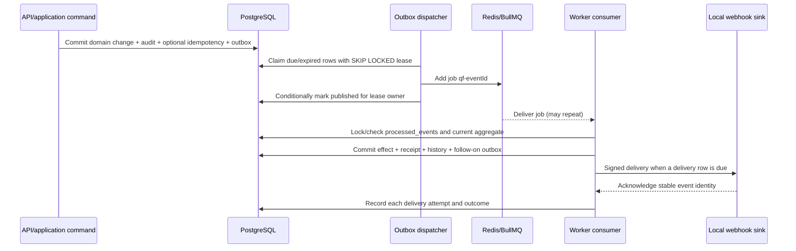

# QueueForge event contracts

## Contract authority

The public v1 event vocabulary and transport constants are defined in `packages/contracts`. PostgreSQL outbox rows are the durable source of event publication state; Redis/BullMQ jobs are delivery attempts. This document explains the contract and processing guarantees but does not replace the executable Zod schemas or database migrations.

All asynchronous semantics are at-least-once. A stable event identifier supports deduplication; it does not promise exactly-once delivery to arbitrary receivers.

## Version 1 envelope

`EventEnvelopeSchema` is strict and currently requires:

| Field           | Type and constraint             | Meaning                                                         |
| --------------- | ------------------------------- | --------------------------------------------------------------- |
| `schemaVersion` | literal `1`                     | Envelope compatibility version                                  |
| `eventId`       | UUID                            | Stable identity for one logical event across retries            |
| `tenantId`      | UUID                            | Tenant scope; consumers must re-establish it against PostgreSQL |
| `eventType`     | string, 3-160 characters        | Named event vocabulary                                          |
| `aggregateType` | string, 1-80 characters         | Kind of aggregate that emitted the event                        |
| `aggregateId`   | UUID                            | Tenant-scoped aggregate identity                                |
| `correlationId` | UUID                            | End-to-end journey correlation                                  |
| `occurredAt`    | offset-aware ISO 8601 timestamp | Time the domain event was committed                             |
| `payload`       | JSON object                     | Event-specific, bounded, non-secret data                        |

The schema rejects additional envelope fields. The current Zod envelope bounds `eventType` syntactically rather than enumerating it, so producers and consumers must use the exported `EVENT_TYPES` constants for the supported v1 vocabulary. The dispatcher sends only explicitly mapped types to BullMQ; an unmapped type remains durable outbox history and is acknowledged without a guessed consumer effect.

## Supported event types

| Constant value               | Meaning                                           | Intended queue                                                          |
| ---------------------------- | ------------------------------------------------- | ----------------------------------------------------------------------- |
| `request.queued`             | A request became eligible for processing          | `queueforge.requests`                                                   |
| `request.approved`           | An approval decision authorized the bound request | `queueforge.requests` through a follow-on queued event, when applicable |
| `request.rejected`           | An approval decision rejected the bound request   | No execution; downstream audit/notification as configured               |
| `request.cancelled`          | A request was cancelled in a cancellable state    | No new execution                                                        |
| `request.succeeded`          | Processing reached a successful terminal state    | Downstream notification or delivery planning as configured              |
| `request.failed`             | A processing attempt failed and was recorded      | Request retry/DLQ policy                                                |
| `request.dead_lettered`      | Bounded processing attempts were exhausted        | Manual operational review/retry                                         |
| `webhook.delivery.requested` | A durable outbound delivery is ready              | `queueforge.webhooks`                                                   |
| `notification.requested`     | A durable notification is ready                   | `queueforge.notifications`                                              |

The three queue names are stable contract constants:

- `queueforge.requests`
- `queueforge.webhooks`
- `queueforge.notifications`

Routing one logical event to another action should create a follow-on outbox event in the same transaction as the consuming effect. Consumers must not manufacture an unrecorded side effect solely from queue state.

## Publication and consumption flow



The outbox dispatcher follows this invariant:

1. The business transaction inserts the event before it commits; a rollback publishes nothing.
2. A dispatcher claims due or expired-lease rows using `FOR UPDATE SKIP LOCKED`, records lease owner, expiry, and attempt, then commits.
3. It enqueues with deterministic BullMQ job ID `qf-<eventId>`.
4. It marks the outbox row published only if it still owns the lease.
5. Publish failure stores a bounded exponential-backoff/jitter retry or a dead state; an expired lease is reclaimable.

A crash after queue insertion and before the published marker is expected to replay. Consumers use a durable receipt keyed by `(tenant_id, consumer, event_id)`. The receipt, database effects, attempt/transition/audit history, and follow-on events commit together, so the receipt remains authoritative even after BullMQ removes retained jobs.

## Correlation and identity rules

- `eventId` is generated once per logical event and never changes across publish, queue, or HTTP retries.
- `correlationId` is accepted when valid or generated at the initial entry point and remains stable across the entire workflow journey.
- `aggregateId` identifies the tenant-scoped request, delivery, or other aggregate; it is never sufficient without `tenantId`.
- Retry attempt numbers belong to attempt records and webhook signing input. They do not create a new logical event ID.
- Manual replay appends new operational history. It does not erase the original failure or reuse an authorization decision without rechecking current state.

## Idempotency versus event deduplication

These controls solve different boundaries:

| Boundary                   | Identity                                                                                    | Behavior                                                                                             |
| -------------------------- | ------------------------------------------------------------------------------------------- | ---------------------------------------------------------------------------------------------------- |
| Durably keyed HTTP command | `(tenant, endpoint scope, key hash)` plus canonical principal/operation/payload fingerprint | Same fingerprint reuses the completed result/resource identity; a different fingerprint conflicts    |
| Worker database effect     | `(tenant, consumer, eventId)`                                                               | Existing committed receipt prevents a repeated database effect                                       |
| BullMQ coordination        | `qf-<eventId>`                                                                              | Reduces duplicate queued jobs but is not the durable receipt                                         |
| Outbound receiver          | Stable `eventId` supplied in signed headers                                                 | Receiver may deduplicate; delivery is still at-least-once                                            |
| Inbound webhook            | Durable `(tenant, endpoint, nonce)` plus external event and idempotency identities          | Rejects nonce reuse; a matching accepted event retried with a fresh nonce returns the stored receipt |

For routes with durable HTTP idempotency, the idempotency record and domain/outbox writes share the command transaction. A pre-commit crash rolls everything back; a post-commit retry returns the recorded response or the same committed resource identity without repeating the effect. Clone draft, activation, and dead-letter retry instead use transactional domain-state handling; the exact route matrix and one-time-secret caveats are in [API design](api-design.md).

## Inbound webhook contract

The inbound endpoint verifies the signature over raw bytes before parsing JSON.

Required headers are:

- `x-queueforge-event-id`
- `x-queueforge-key-id`
- `x-queueforge-nonce`
- `x-queueforge-signature`
- `x-queueforge-timestamp`
- `idempotency-key`

The canonical HMAC-SHA256 input is:

```text
timestamp.nonce.eventId.idempotencyKey.keyId.rawBody
```

`x-queueforge-timestamp` is Unix time in seconds. `x-queueforge-signature` is the 64-character hexadecimal digest with no prefix.

The five dot-separated header fields are UTF-8 text followed immediately by the exact raw request bytes. Verification requires the endpoint's versioned key ID, a timestamp within five minutes, a durable unused tenant/endpoint nonce, an equal-length constant-time signature comparison, and a payload within the configured limit of at most 1 MiB. Binding the event ID, idempotency key, and key ID prevents a valid signed body from being replayed under substituted identity headers. Invalid, stale, unknown-key, or replayed requests fail before domain mutation.

A duplicate-safe retry reuses the accepted event ID, idempotency key, and exact payload but must send a fresh nonce and recomputed signature. Reusing the original nonce is always rejected as replay.

An accepted response conforms to `WebhookReceiptSchema`:

| Field       | Meaning                                                                       |
| ----------- | ----------------------------------------------------------------------------- |
| `accepted`  | Whether the event was accepted for durable handling                           |
| `duplicate` | Whether the response reuses a previously accepted event receipt               |
| `eventId`   | The external event UUID                                                       |
| `requestId` | The created or previously associated QueueForge request UUID, when applicable |

## Outbound webhook contract

Required outbound headers are:

- `x-queueforge-attempt`
- `x-queueforge-event-id`
- `x-queueforge-key-id`
- `x-queueforge-signature`
- `x-queueforge-timestamp`

The canonical HMAC-SHA256 input is:

```text
eventId.timestamp.attempt.rawBody
```

`x-queueforge-timestamp` is Unix time in seconds, `x-queueforge-attempt` is a positive integer, and `x-queueforge-signature` is `sha256=` followed by the 64-character hexadecimal digest.

The delivery row snapshots the target URL, JSON event payload, event ID, and key version. Each attempt validates that binding and canonicalizes the stored envelope to the same UTF-8 bytes before signing, while incrementing its attempt number. Delivery disables redirects, enforces a timeout, permits only `http` or `https`, and resolves and rechecks the exact local allowlist before connection. Every attempt and outcome is append-only history.

Webhook secret values are encrypted at rest with authenticated encryption metadata and explicit master-key version. The persistence rotation primitive retains active and retiring versions long enough to verify or deliver already committed work. Secret values and raw credentials must not enter event payloads, metrics, or audit metadata. HTTP logging explicitly redacts authorization/cookie, signature, CSRF, and idempotency headers plus named REST/GraphQL credential fields; the configured paths have a regression test.

## Compatibility rules

For schema version 1:

- do not rename or reinterpret an existing envelope field;
- do not change an event's identity or correlation semantics;
- additive payload fields must be optional to existing consumers;
- a breaking envelope or payload change requires a new schema version and an explicit consumer migration;
- producers persist the exact emitted payload so retries do not observe mutable workflow configuration;
- consumers validate the envelope and their event-specific payload before applying effects;
- unknown schema versions fail into observable retry/dead handling; unmapped event types are retained as outbox history and acknowledged without dispatching an invented consumer effect.

Contract tests must cover the Zod envelope, exported constants, header spelling, signature canonicalization, stable event IDs across retry, duplicate receipt behavior, unknown event handling, and redaction. Integration tests must additionally prove rollback safety, dual-dispatcher locking, post-enqueue crash replay, Redis interruption recovery, and separate request and delivery dead-letter histories.

## Claim boundary

Successful local tests may support claims of a transactional PostgreSQL outbox, at-least-once processing, durable deduplication of QueueForge database effects, and receiver-side deduplication in the included local sink. They cannot support a claim of exactly-once BullMQ execution or exactly-once delivery to external webhook receivers.
