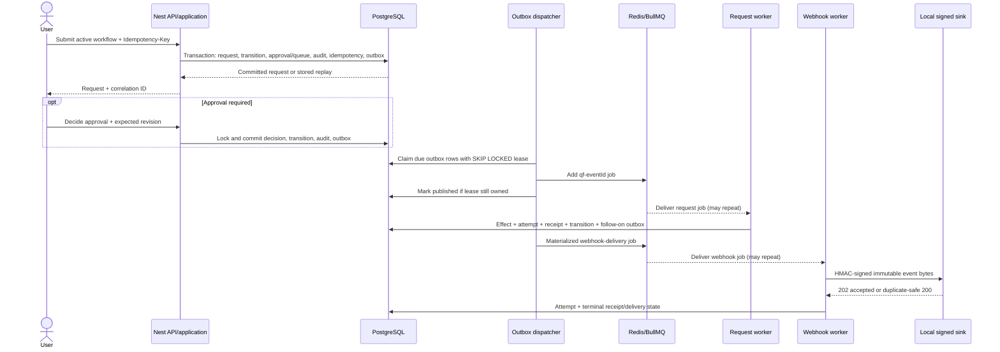
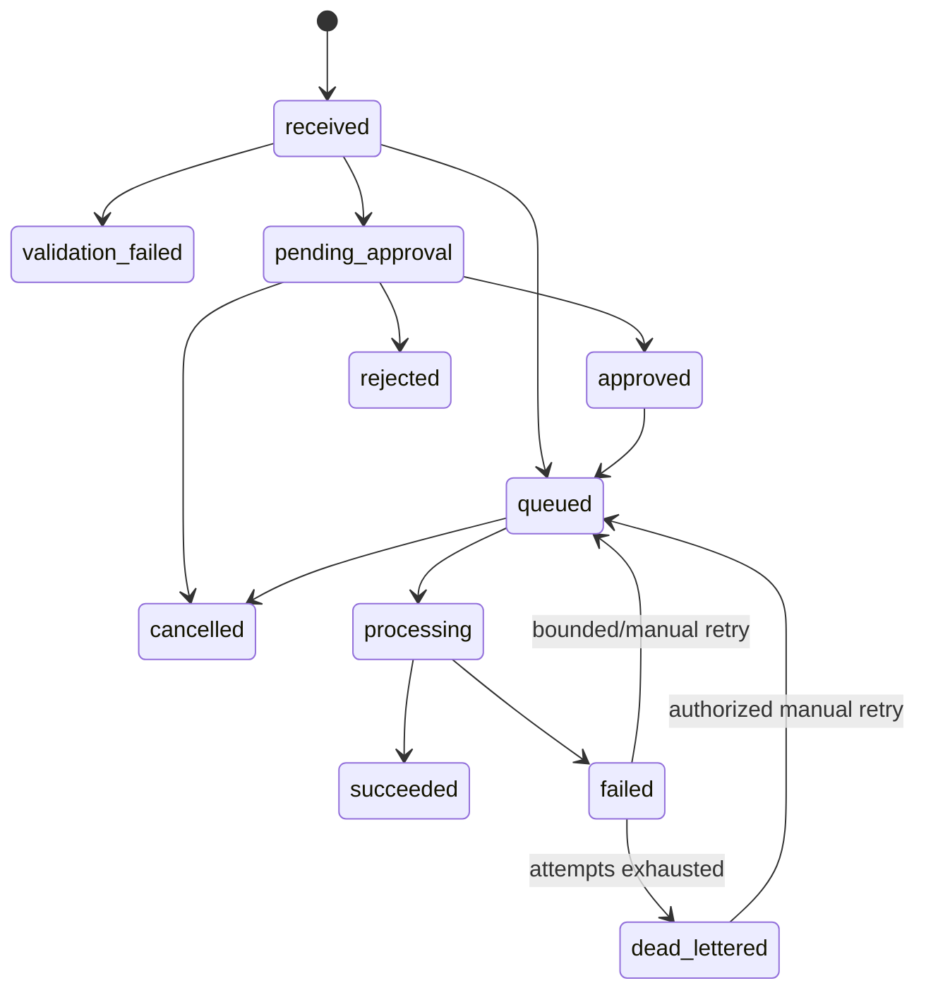

# QueueForge event flow

## The end-to-end path

The primary QueueForge story is one correlated journey from an authenticated command to observable local effects:



The API returns after PostgreSQL commits; it does not wait for Redis, request execution, or webhook delivery.

## 1. Intake and workflow binding

REST and GraphQL submission both call the same application service. The service:

1. establishes tenant context from the verified user session or API-client credential;
2. resolves the enabled active workflow by stable key;
3. validates the payload against the workflow's JSON schema without coercion;
4. hashes canonical payload bytes;
5. creates a request bound to the exact workflow template and version;
6. records `received`, followed by either `validation_failed`, `pending_approval`, or `queued`;
7. completes the idempotency response and appends bounded audit/outbox records in the same transaction.

Request source is one of `rest`, `graphql`, `inbound_webhook`, or `system`. The source does not alter tenancy or workflow validation.

## 2. Approval branch

An approval-required workflow creates a task bound to request ID, workflow version ID, canonical payload hash, requester, revision, and self-approval policy.



The deciding transaction locks task and request, rechecks expected revision and role, prevents self-approval when configured, inserts one decision, and advances the request. An identical replay returns the stored decision; a stale, opposite, or forbidden decision does not execute the request.

## 3. Transactional outbox

The outbox event uses the shared version-1 envelope:

```json
{
  "schemaVersion": 1,
  "eventId": "uuid",
  "tenantId": "uuid",
  "eventType": "request.queued",
  "aggregateType": "workflow_request",
  "aggregateId": "uuid",
  "correlationId": "uuid",
  "occurredAt": "2026-08-24T12:00:00.000Z",
  "payload": {}
}
```

The dispatcher polls in batches of 25, first recovering up to 100 expired leases on startup. It claims due rows with `FOR UPDATE SKIP LOCKED`, assigns an owner and lease, and commits before publishing.

Mapped internal events are:

| Event                        | BullMQ queue               | Consumer                          |
| ---------------------------- | -------------------------- | --------------------------------- |
| `request.queued`             | `queueforge.requests`      | Request executor                  |
| `webhook.delivery.requested` | `queueforge.webhooks`      | Signed webhook delivery           |
| `notification.requested`     | `queueforge.notifications` | Local in-app/console notification |

Other outbox event types remain durable observational history and are acknowledged without an internal queue consumer.

The job ID is deterministic: `qf-<eventId>`. BullMQ attempts a job up to 10 times using QueueForge's bounded exponential backoff: 1 second base, 20% jitter, and a 60-second ceiling. Completed jobs are retained for up to one day and failed jobs for up to seven days, both capped at 1,000 retained jobs per queue.

## 4. Failure window and deduplication

PostgreSQL and Redis do not share a distributed transaction. If the worker adds a BullMQ job and crashes before marking the outbox row published, the expired lease is reclaimed and the same event may be published again.

QueueForge treats that replay as normal:

- deterministic BullMQ IDs reduce duplicate coordination work;
- each consumer checks a durable `(tenant_id, consumer, event_id)` receipt;
- effect, receipt, attempts, transitions, audit, and follow-on events commit together;
- stale or interrupted request attempts are recovered by time threshold;
- terminal attempt exhaustion creates a separate dead-letter record.

This provides at-least-once processing with deduplicated QueueForge database effects when its tests pass. It is not exactly-once BullMQ execution.

## 5. Request execution and targets

The request worker transitions `queued -> processing`, executes the immutable version's processor target under a configured timeout, reports progress to BullMQ, and commits success or failure.

A successful request may materialize effect records and follow-on outbox events for ordered workflow targets:

- `processor`: local demonstration handler;
- `webhook`: immutable endpoint/event/key snapshot;
- `notification`: user- or role-addressed message.

Request attempt budget defaults to five. Failures return to the queue while budget remains; exhaustion creates an open request dead letter and transitions to `dead_lettered`. Authorized retry appends history and resets a bounded attempt budget rather than erasing the failure.

## 6. Outbound webhook delivery

The delivery row snapshots endpoint ID, target URL, complete event payload, event ID, generation, key ID, attempt counters, and next-attempt time. Each attempt:

1. claims or recovers a delivery lease;
2. validates the stored event/tenant binding;
3. decrypts the exact versioned signing secret;
4. canonicalizes the immutable JSON envelope to raw UTF-8 bytes;
5. resolves an exact allowlisted host, optionally blocks private networks, and pins the selected address;
6. disables redirects, applies the configured timeout, and sends the signed body;
7. records status/duration/bounded response excerpt or safe error;
8. commits a durable consumer receipt on terminal delivery/dead state.

The signature is HMAC-SHA256 over:

```text
eventId.timestamp.attempt.rawBody
```

Required header spelling is in [event contracts](event-contracts.md). The included sink validates exact bytes, key ID, timestamp window, and event ID. It remembers up to 10,000 stable event IDs in memory and treats the same event/body as a duplicate-safe success; it rejects an event-ID collision with different bytes.

Delivery status is `pending`, `delivering`, `retry`, `delivered`, or `dead`. HTTP/network classification and attempt budget determine retry versus terminal handling. Manual replay creates a new `generation` while preserving the original delivery and attempt history.

Exactly-once delivery to an arbitrary HTTP receiver is not claimed. Receivers should deduplicate the stable `x-queueforge-event-id`.

## 7. Inbound signed webhooks

The public inbound route verifies HMAC-SHA256 over raw bytes before JSON parsing:

```text
timestamp.nonce.eventId.idempotencyKey.keyId.rawBody
```

It binds the raw body to the event ID, idempotency key, and key version; enforces the five-minute default clock window, durable nonce uniqueness, signature length, constant-time comparison, and 1 MiB maximum; and retains a future-dated nonce through the entire signature-validity window. A duplicate-safe retry must reuse the accepted event identity, idempotency key, and payload while supplying a fresh nonce and corresponding signature; it then returns the durable receipt. Reusing a nonce is rejected as replay. Invalid, stale, unknown-key, or replayed requests do not reach request submission.

## 8. Correlation and operations

`correlationId` remains stable across HTTP, request rows, transitions, outbox, jobs, delivery attempts, notifications, and audit events. `requestId` identifies one HTTP interaction and should not replace correlation.

Useful local surfaces:

- `/api/v1/dashboard/overview`: status, queues, throughput, recent requests;
- `/api/v1/requests/:id/timeline`: ordered state history;
- `/api/v1/operations/queues`: queue/outbox/worker snapshot;
- `/api/v1/operations/dead-letters`: open intervention records;
- `/api/v1/webhooks/deliveries`: delivery state and latest HTTP result;
- `/api/v1/audit`: immutable-for-runtime tenant audit trail;
- `/api/v1/health/ready`: PostgreSQL and Redis dependency status;
- `/api/v1/metrics`: Prometheus-format process/API metrics.

## Recovery expectations

| Failure                                       | Expected behavior                                                    |
| --------------------------------------------- | -------------------------------------------------------------------- |
| PostgreSQL unavailable at API                 | Readiness 503 and bounded command failure; no false commit           |
| Redis unavailable during outbox publish       | Outbox retry/dead state; committed domain work remains in PostgreSQL |
| Worker exits with leased outbox work          | Shutdown releases owned leases; startup also recovers expired leases |
| Worker exits during request attempt           | Stale attempt recovered; attempt budget enforced                     |
| Webhook times out or returns retryable status | Append attempt and schedule bounded retry                            |
| Webhook terminal failure/exhaustion           | Delivery `dead` plus separate dead-letter history                    |
| Duplicate event/job                           | Durable consumer receipt prevents repeated QueueForge DB effect      |
| Manual retry/replay                           | New attributable operational history; original failure retained      |

Run evidence, not this design description, determines whether a recovery claim is currently proven. See [testing](testing.md) for the mapped probes.
