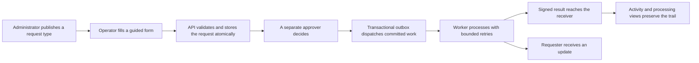
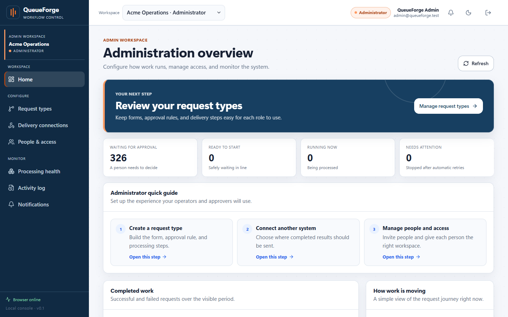
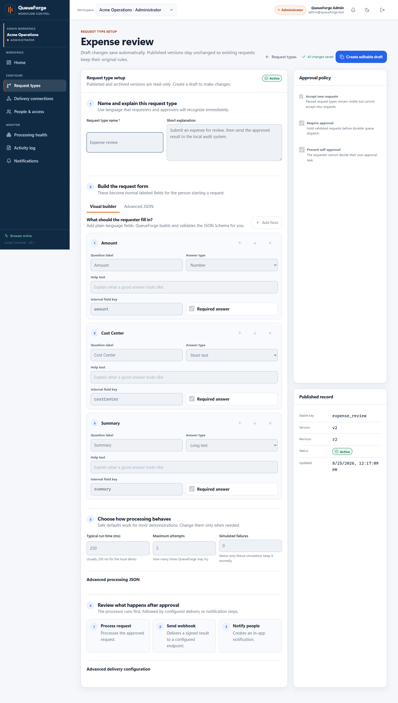
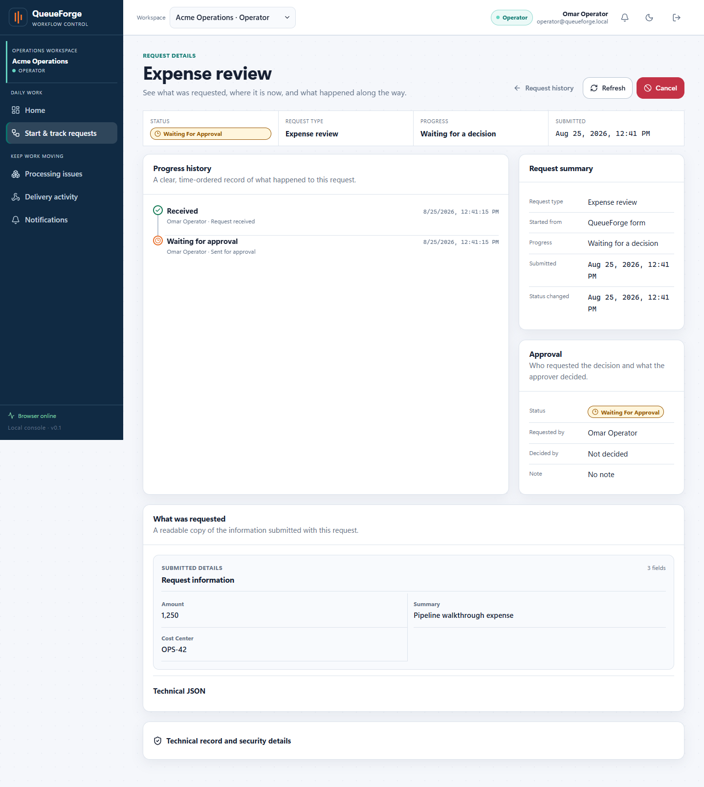
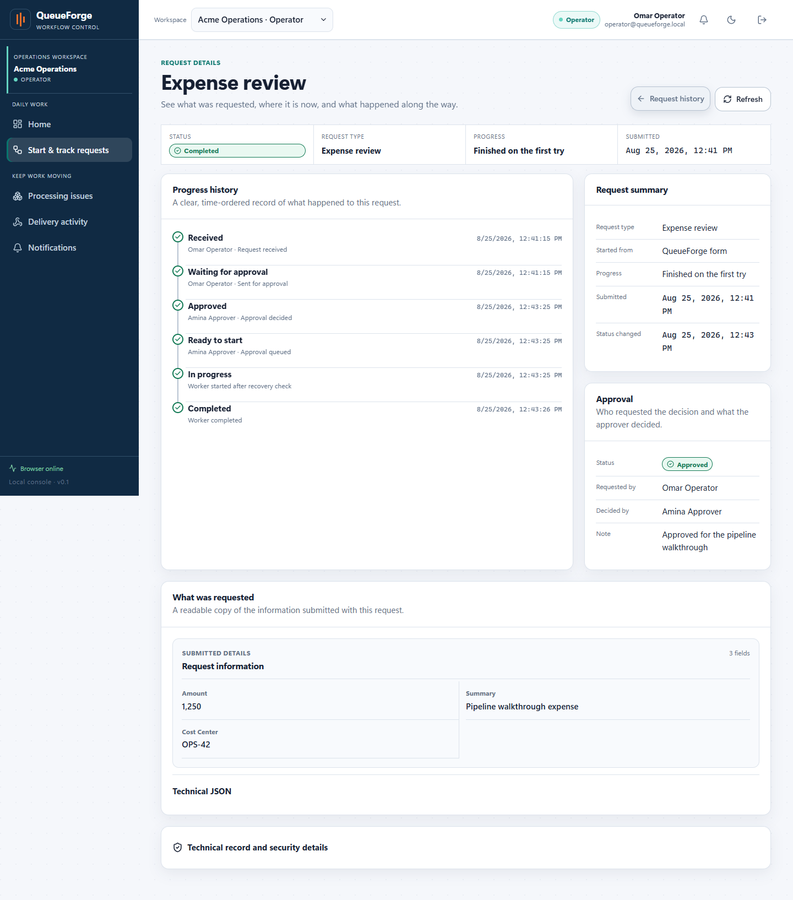
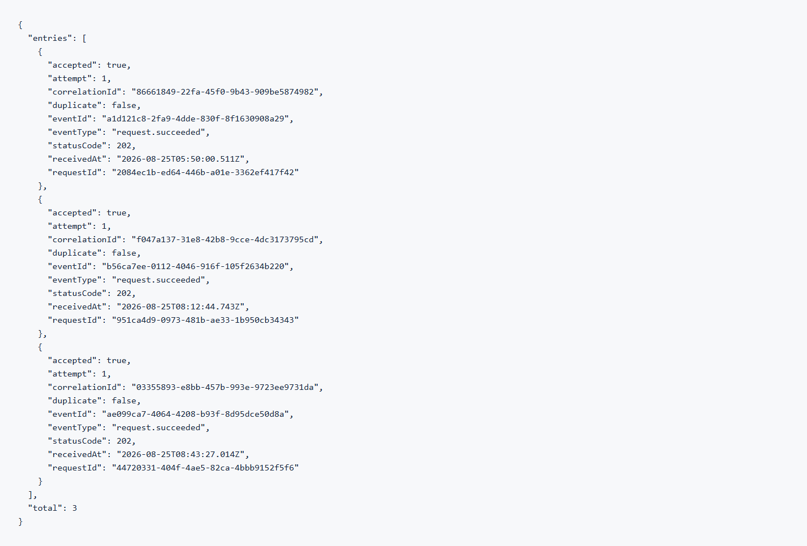
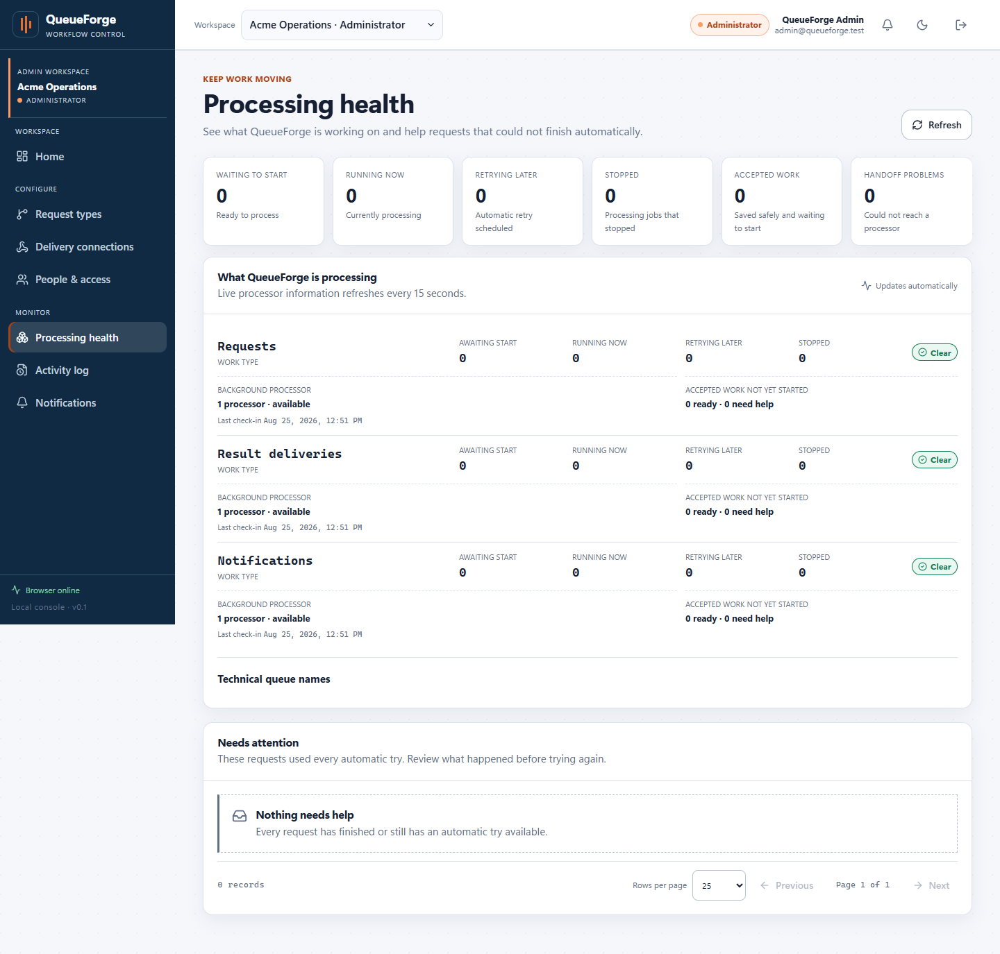

# QueueForge pipeline walkthrough

This folder is a visual, step-by-step explanation of QueueForge. Start here if you are new to the project, then use [MASTER_PROMPT.md](./MASTER_PROMPT.md) for the complete repository handoff.

## The problem QueueForge solves

Important business requests often need more than a form submission. They may need validation, approval by a different person, background processing, automatic retries, delivery to another system, and a trustworthy history of what happened. A basic implementation can lose work, repeat side effects, mix tenant data, or leave users unable to understand a failure.

QueueForge coordinates that journey. It separates responsibilities by role, keeps PostgreSQL as the durable source of truth, dispatches committed work through a transactional outbox, processes it through BullMQ workers, delivers signed results, and exposes readable status, notification, recovery, and audit views.

## The example shown in these screenshots

All names and values are synthetic local-demo data.

- Workspace: `Acme Operations`
- Request type: `Expense review`, active immutable version `v2`
- Requester: `Omar Operator`
- Approver: `Amina Approver`
- Submitted values: Amount `1,250`, Cost Center `OPS-42`, Summary `Pipeline walkthrough expense`
- Approval note: `Approved for the pipeline walkthrough`
- QueueForge request reference: `ec2a5104-92df-44a3-86d4-3a523e001dd2`
- End-to-end trace reference: `03355893-e8bb-457b-993e-9723ee9731da`
- Result: completed on the first processing attempt, one notification created, and one signed result delivery accepted with HTTP `202`

The local database also contains older synthetic load-test rows. The timestamps and compact request reference above identify the single correlated walkthrough used here.

## Pipeline at a glance

## Numbered visual walkthrough

### Step 1: Administrator sees the workspace and system overview

The selected workspace is `Acme Operations`, and the orange role badge identifies the Administrator experience. This workspace is for configuration, access management, processing health, and audit visibility rather than everyday submission or approval work.

### Step 2: Responsibilities are separated by role

The demo has distinct administrator, operator, and approver identities. Starter demo roles are locked so the walkthrough stays reliable. In real use, server-side authorization enforces what each role can do; hidden navigation alone does not.

### Step 3: A delivery connection is ready

The `Local audit sink` is the configured local receiver. QueueForge will sign completed-result deliveries so the receiving system can verify their origin. Signing secrets remain collapsed and are never shown in this folder.

### Step 4: The administrator publishes an immutable request type

The `Expense review` request type defines three normal questions, requires a separate approver, prevents self-approval, sets bounded processing attempts, and sends the approved result to the configured receiver. Published versions are read-only so an in-flight request always keeps the rules it started with.

### Step 5: The operator fills a normal guided form

Omar chooses the request type and enters ordinary labeled fields. The operator never needs to write JSON; QueueForge creates and validates the structured payload behind the form.

### Step 6: The accepted request waits for a separate decision

The request is stored and visible immediately, but processing is blocked at `Waiting for approval`. The page shows who requested the decision and the exact readable values that were submitted.

### Step 7: Amina reviews and approves the request

Amina sees the requester and readable request details before deciding. She is a different authenticated principal from Omar, which demonstrates the separation-of-duties rule.

### Step 8: Durable dispatch and worker processing complete the request

The timeline preserves each state: received, waiting, approved, ready, in progress, and completed. Internally, the approval transaction appends an outbox event; the dispatcher publishes a deterministic BullMQ job; and the worker records progress and completion in PostgreSQL.

### Step 9: QueueForge records the result delivery

The delivery view is filtered to the walkthrough request. It shows the destination, related request type and reference, one delivery try, and the receiver's HTTP `202` acceptance.

### Step 10: The separate receiver confirms acceptance

The local receiver independently reports `accepted: true`, `duplicate: false`, event type `request.succeeded`, and HTTP status `202`. Match the walkthrough by trace reference `03355893-e8bb-457b-993e-9723ee9731da`; other entries are older synthetic receiver history.

### Step 11: The requester receives readable updates

Omar receives both the approval and completion updates, each labeled with the request type and compact request reference.

### Step 12: The administrator can follow the same trace in the activity log

The readable audit row explains the completion. Opening `View` reveals the stable event code, the same request reference, and trace reference without exposing credentials or payload secrets.

### Step 13: The same request is not visible in another tenant

With `Beta Logistics` selected, the Acme request is reported as not found. This deliberately avoids revealing whether another tenant owns the supplied identifier.

### Step 14: Processing health and recovery remain visible

The processing page separates request, result-delivery, and notification work, shows worker freshness, and exposes the `Needs attention` area used when automatic attempts are exhausted. In this successful capture all queues are clear and nothing needs manual recovery.

## Important steps that a screenshot cannot honestly prove

Some guarantees are invisible or would produce a duplicate-looking screenshot. Use the linked source and tests instead of treating the UI as proof:

- Strict validation, canonical payload hashing, immutable version binding, idempotency, transitions, audit rows, and outbox insertion share a PostgreSQL transaction. See `packages/persistence/src/stores/request-submission.store.ts` and the integration tests.
- Repeating a submission with the same idempotency key returns the same durable result. The browser page would look identical, so the Playwright journey and idempotency tests are the useful proof.
- BullMQ is at-least-once. QueueForge-owned database effects use durable receipts and deterministic job/event identifiers; this is not a claim of exactly-once execution or delivery to arbitrary receivers.
- Webhook signatures, nonce/timestamp checks, redirect blocking, and destination policy are proved in source and security/integration tests, not by the receiver screenshot alone.
- Automatic retry and manual dead-letter recovery are exceptional branches. Step 14 shows the recovery surface; `tests/e2e/queueforge-journey.spec.ts`, `tests/integration/worker-recovery.spec.ts`, and the persistence integration suites prove the retry paths.
- Tenant scoping and database constraints are implemented and integration-tested. Step 13 is only the visible behavior.

## Recommended reading order after the screenshots

1. [MASTER_PROMPT.md](./MASTER_PROMPT.md)
2. `../../../README.md`
3. `../../event-flow.md`
4. `../../architecture.md`
5. `../../demo-script.md`
6. `../../security.md` and `../../threat-model.md`
7. `../../testing.md`

## Capture and privacy notes

- Captured on `2026-08-25` from the packaged full Docker Compose profile on loopback.
- Desktop viewport: `1440 × 900`; full-page captures are taller where the page contains important content below the fold.
- All displayed identities, request values, identifiers, and receiver entries belong to the synthetic local demo.
- No password, bearer token, refresh token, cookie, CSRF token, signing secret, `.env` value, personal browser tab, terminal, or developer-tools view is included.
- Screenshot pixels demonstrate the visible journey. The repository's tests and technical documentation remain the authority for invisible correctness and security properties.
