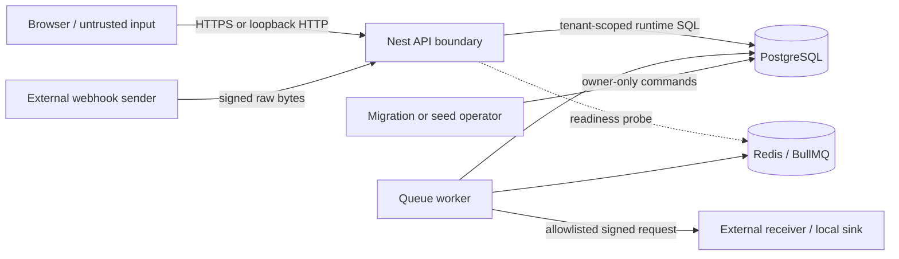

# Threat model

## Scope and assumptions

This model covers the QueueForge browser, REST/GraphQL API, inbound webhook route, worker and BullMQ
queues, PostgreSQL, Redis, the local webhook sink, and the Compose/network boundary. It assumes an
attacker can send arbitrary network requests and workflow payloads, replay captured messages, race
valid operations, control a configured receiver, or hold a low-privilege tenant account. It does not
assume compromise of the host, database-owner credentials, or the webhook master key.

The supported deployment for the current dependency set is loopback-only. Internet exposure is an
explicitly blocked scenario until the vendor security gate in [security.md](security.md) passes.

## Assets

| Asset                                                     | Security objective                                                  |
| --------------------------------------------------------- | ------------------------------------------------------------------- |
| Tenant workflow definitions and request payloads          | Confidentiality, tenant isolation, immutable version history        |
| User sessions and API-client credentials                  | No disclosure, replay resistance, immediate revocation              |
| Webhook signing secrets and payload snapshots             | Confidentiality at rest, authentic bytes, stable retry identity     |
| Approval, audit, attempt, receipt, and transition history | Append-only integrity and attributable correlation                  |
| Outbox, queue, and dead-letter state                      | Atomic effects, bounded retries, recoverability without duplication |
| PostgreSQL/Redis/worker availability                      | Bounded resource use and graceful dependency failure                |

## Trust boundaries

Crossing the API boundary never establishes tenant context from body data. Crossing the worker
egress boundary revalidates the destination and signs the immutable payload snapshot. Database-owner
and migration privileges are separate from the runtime application role.

## Principal threats and controls

| Threat / abuse path                                          | Impact                                                  | Primary controls                                                                                                                                                                                                                                                      | Residual risk / required operation                                                                        |
| ------------------------------------------------------------ | ------------------------------------------------------- | --------------------------------------------------------------------------------------------------------------------------------------------------------------------------------------------------------------------------------------------------------------------- | --------------------------------------------------------------------------------------------------------- |
| Change a tenant ID or resource UUID to access another tenant | Cross-tenant disclosure or mutation                     | Authenticated database-backed membership, tenant-scoped queries, composite tenant FKs, negative integration tests                                                                                                                                                     | A new query can regress; retain tenant-isolation tests for every read/write surface                       |
| Steal or replay browser credentials                          | Account takeover                                        | Short access TTL, rotating hashed refresh tokens, reuse-family revocation, `HttpOnly` refresh cookie, CSRF double submit, origin check, configurable `Secure` cookies when TLS is enabled                                                                             | Host/browser compromise is out of scope; revoke memberships and refresh families after suspected theft    |
| Replay or substitute an API key                              | Unauthorized automation                                 | Random one-time key, domain-separated HMAC hash, tenant/key binding, constant-time comparison, role restriction, revocation                                                                                                                                           | Plaintext is visible once; the operator must store it securely and rotate by replacement/revocation       |
| Reuse one idempotency key with a different action            | Confused-deputy or replayed side effect                 | Tenant/operation/principal scope, canonical fingerprint, transactional stored response, conflict on mismatched reuse                                                                                                                                                  | State-handled commands do not promise stored HTTP replay responses                                        |
| Race identical submissions or approvals                      | Duplicate requests, decisions, outbox, or audit effects | Unique constraints, row locks, atomic transactions with bounded transient retry, concurrency integration tests                                                                                                                                                        | Sustained overload can still return a safe failure; capacity limits and retry telemetry must be monitored |
| Forge, replay, or send malformed inbound webhook JSON        | Unauthorized request or parser abuse                    | Route-specific raw parser, body limit, timestamp window, enabled key lookup, HMAC before JSON parse, timing-safe comparison, durable nonce and accepted-event receipts; nonce reuse is rejected while a matching event retried with a fresh nonce returns its receipt | Sender/receiver clock skew and secret rotation require operational coordination                           |
| Redirect/rebind an outbound webhook to an internal service   | SSRF or secret-bearing request exfiltration             | Protocol validation, redirects disabled, hostname allowlist, resolution/recheck per attempt, private-network policy, request timeout                                                                                                                                  | Demo mode permits private loopback; production must deny private ranges and narrowly configure egress/DNS |
| Read webhook secrets from storage or swap ciphertext         | Signature forgery                                       | AES-256-GCM, random IV, AAD bound to tenant/endpoint/key/version, master key outside DB, one-time UI reveal                                                                                                                                                           | Master-key compromise exposes all active secrets; use managed key storage and rotation for production     |
| Crash after effect but before acknowledgement                | Duplicate or lost side effect                           | Transactional outbox, processed-event receipt committed with effects, leased claims/CAS, stable event IDs, receiver idempotency, recovery tests                                                                                                                       | External HTTP outcome can be unknown; receivers must deduplicate stable event IDs                         |
| Force infinite retries or queue exhaustion                   | Resource denial                                         | Attempt budgets, exponential backoff, timeouts, DLQs, manual audited replay, queue metrics, worker concurrency caps                                                                                                                                                   | Local hardware is constrained; expose backpressure alerts before raising concurrency                      |
| Modify audit or execution history through the app role       | Evidence tampering                                      | Append-only triggers, runtime UPDATE/DELETE/TRUNCATE revokes, immutable workflow versions                                                                                                                                                                             | Database-owner compromise remains out of scope; production needs backups and external audit retention     |
| Abuse GraphQL aliases/depth/variables or introspection       | CPU/memory denial or schema discovery                   | Depth/list/alias/complexity/node limits, throttling, CSRF prevention, production introspection off, normalized errors                                                                                                                                                 | Cost estimates are approximate; profile new resolvers and assign explicit field costs when added          |
| Leak credentials in logs/errors                              | Secret disclosure                                       | Generic 5xx responses, no GraphQL stacks, explicit Pino redaction for headers/body/variables/cookies, synthetic fixtures                                                                                                                                              | New credential fields require redaction tests before release                                              |
| Use a vulnerable frontend dependency                         | Client or server compromise                             | Exact pins, lockfile policy, dependency audit, fail-closed dated Next.js gate                                                                                                                                                                                         | This gate is open on 2026-08-24; deployment remains loopback-only                                         |

## Security invariants to preserve

1. A tenant-owned row is never selected or mutated without an authenticated tenant scope.
2. A workflow request points to the immutable version that was active at submission (even if that
   version is later retired) and executes its single processor target plus processing policy.
3. A processed-event receipt and its terminal business effects commit atomically.
4. An idempotent replay never creates a second durable effect and never reveals a one-time secret.
5. Inbound HMAC verification operates on the captured bytes before JSON parsing or durable mutation.
6. Outbound retries reuse the exact event ID and canonical persisted payload bytes.
7. Interrupted or exhausted work reaches a recoverable, auditable terminal state within a bounded
   attempt budget.
8. Public 5xx and GraphQL error surfaces do not disclose stack traces, SQL, secrets, or payloads.

## Verification and review triggers

Re-run the threat model when adding a role, authentication mechanism, queue consumer, workflow target
kind, external host, secret type, database table, GraphQL resolver, or deployment topology. Each new
trust-boundary crossing needs a negative test, an authorization decision, safe logging treatment,
failure/retry semantics, and an operator recovery path.
